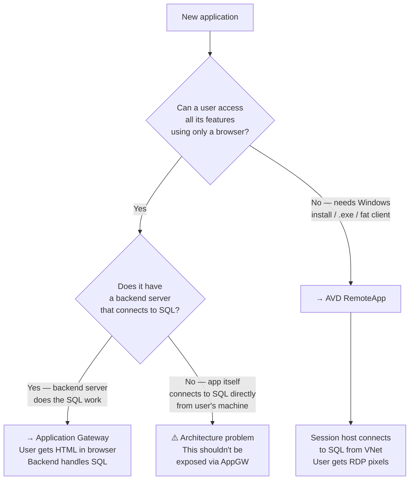

## The Core Difference: Where Does the App Logic Run?

mermaid

````mermaid
flowchart LR
    subgraph AGW_MODEL["Application Gateway Model"]
        direction TB
        U1["👤 User\n(browser)"]
        AGW["Application Gateway\nSSL termination · WAF"]
        WEB["Web Server\n(App Service / VM)"]
        DB1[("Azure SQL\nPrivate Endpoint")]
        U1 -->|"HTTPS"| AGW
        AGW -->|"HTTP"| WEB
        WEB -->|"TCP 1433\nfrom inside VNet"| DB1
    end

    subgraph AVD_MODEL["AVD RemoteApp Model"]
        direction TB
        U2["👤 User\n(AVD client)"]
        AVD["AVD Broker\nRDP over HTTPS"]
        HOST["Session Host VM\nApp installed here"]
        DB2[("Azure SQL\nPrivate Endpoint")]
        U2 -->|"RDP/HTTPS"| AVD
        AVD -->|"RDP session"| HOST
        HOST -->|"TCP 1433\nfrom inside VNet"| DB2
    end
```

The answer is actually the same in both models — **the database connection always originates from inside the VNet**. The user never connects to SQL directly. The difference is purely in **how the application reaches the user**.

---

## How Web Apps Handle Database Connections

Take **Grafana** (`monitor.ravago.com`) or **Odoo** as examples from your environment. Here is what actually happens:
```
1. User opens Chrome and goes to monitor.ravago.com
2. Application Gateway receives the HTTPS request
3. AppGW forwards it to the Grafana backend server (HTTP internally)
4. Grafana backend code (running on the server) queries Azure SQL / Log Analytics
5. That query goes TCP 1433 from the backend server → Private Endpoint
6. Grafana renders the result as HTML/JSON
7. AppGW sends the HTML back to the browser
8. User sees a web page
````

**The user never touches the database.** The browser only ever receives HTML, CSS, JavaScript, and JSON. The database connection is made by the **backend server code** — which lives inside the VNet, just like the AVD session host does.

---

## The Real Question to Ask About Any Application

Forget AVD vs AppGW for a moment. Ask just **one question**:

mermaid



---

## Side-by-Side Comparison With Real Ravago Examples

|Application|Type|Published via|Where SQL connection happens|
|---|---|---|---|
|**Grafana** (`monitor.ravago.com`)|Web app|Application Gateway|Grafana backend server → Private Endpoint|
|**Odoo**|Web app|Application Gateway|Odoo backend server → PostgreSQL Private Endpoint|
|**BRILL Formulation**|Fat Windows client|AVD RemoteApp|Session host VM → SQL Private Endpoint|
|**EKRON ERP**|Fat Windows client|AVD RemoteApp|Session host VM → SQL Private Endpoint|
|**SAP GUI**|Fat Windows client|AVD RemoteApp|Session host VM → SAP backend|
|**Promic Formula Integration**|Windows Service|Neither — runs as service|vmemeabrill001p → SQL Private Endpoint|

In **every single case**, the database connection originates from a server inside the VNet. The user never reaches SQL directly. The only difference is how the application UI reaches the user — as a web page, or as a remote Windows session.

---

## The Simple Mental Model

Think of it this way:

> **Application Gateway** is a smart front door for web servers. The web server does all the heavy lifting — SQL, business logic, rendering — and sends back a finished web page to the browser.

> **AVD RemoteApp** is a window into a remote Windows machine. The app runs entirely on the session host — SQL, business logic, everything — and sends back only the rendered screen pixels to the user.

In both cases the database never leaves the VNet. What changes is whether the "rendered output" that reaches the user is a **web page** or **screen pixels**.

---

## How to Classify Any New Application

When a new application arrives, ask these questions in order:

**Question 1 — Does the user access it via a browser with no install?**

- Yes → candidate for **Application Gateway**
- No → go to Question 2

**Question 2 — Does it require a Windows installer / .exe / specific OS?**

- Yes → **AVD RemoteApp**
- No (it's a background service) → **neither**, runs as a Windows Service

**Question 3 — For web apps: does the vendor provide a web/cloud version?**

- Yes → confirm it exposes HTTP/HTTPS → **Application Gateway**
- No, only a desktop client → **AVD RemoteApp** regardless

**Question 4 — Edge case: does the vendor offer both?**

- Some ERPs (SAP, some Dynamics modules) offer both a fat client AND a web portal
- Fat client → **AVD**, Web portal → **Application Gateway**
- Both can coexist pointing to the same backend database

---

This is exactly why the BRILL vendor's answer was so telling — they described RemoteApp instinctively, because BRILL has no web interface. There was never an Application Gateway option on the table.