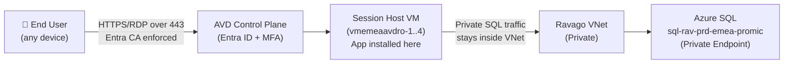
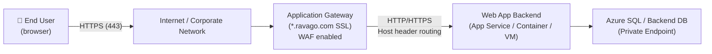
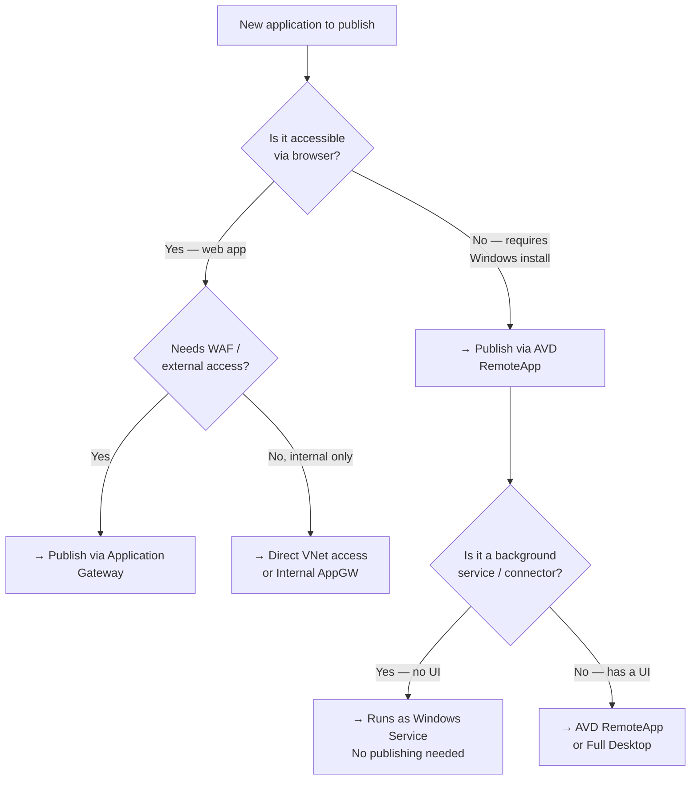
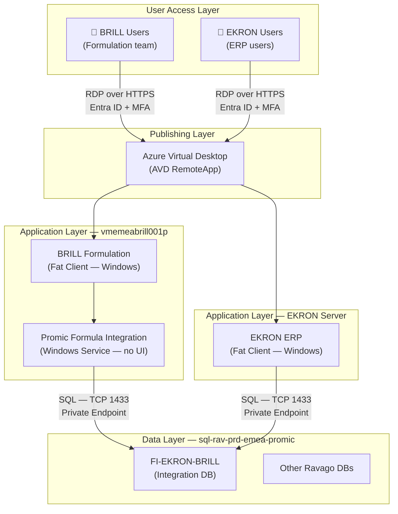

# Application Publishing Strategy — AVD vs Application Gateway

**Department:** IT Infrastructure  
**Author:** Carlos Fernández  
**Classification:** Internal use only  
**Version:** 1.0  
**Date:** 2026-03-16

## 1. Overview

When publishing applications to end users at Ravago, two primary delivery mechanisms are available: **Azure Virtual Desktop (AVD)** and **Azure Application Gateway**. Choosing the right one depends on the nature of the application — specifically whether it is a _fat client_, a _thin client_, or a _web application_.

This document defines each application type, explains the publishing options available, and provides a decision framework and best practices applied to the EKRON-BRILL integration project.

---

## 2. Application Types Explained

### 2.1 Fat Client (Thick Client)

A **fat client** is a traditional desktop application that:

- Is installed locally on the operating system (`.exe`, `.msi`, installer required)
- Contains most of its own business logic and processing power
- Connects **directly** to backend services (SQL Server, APIs, file shares) using proprietary protocols
- Requires a specific Windows environment to run (dependencies, runtimes, registry entries)
- Cannot be accessed through a browser

**Examples at Ravago:** Ekon (Cegid), BRILL Formulation, SAP GUI, Totvs Protheus

> [!important] Fat clients **cannot** be published via Application Gateway. They require either local installation or a remote desktop session (AVD).

---

### 2.2 Thin Client

A **thin client** refers to two distinct concepts — it is important not to confuse them:

#### 2.2.1 Thin Client as a Device

A low-powered hardware device (small form factor PC or terminal) with minimal local processing. It does not run applications locally — it connects to a remote session (RDP/AVD) where all processing happens server-side. The device is just a screen, keyboard, and network card.

#### 2.2.2 Thin Client as an Application Architecture

An application where **most logic lives on the server**, and the client-side is lightweight. The user's device only renders the UI. This is effectively what AVD RemoteApp delivers — the app runs on the session host, the user sees only the rendered window.

---

### 2.3 Web Application

A **web application** is accessed entirely through a browser (Chrome, Edge, Firefox):

- No installation required on the end-user device
- Uses standard HTTP/HTTPS protocols
- Business logic runs on a backend server or cloud service
- Frontend is HTML/CSS/JavaScript rendered by the browser
- Can be accessed from any device (laptop, tablet, mobile)

**Examples at Ravago:** Odoo, Azure DevOps portal, Grafana (`monitor.ravago.com`), any internal portal published via Application Gateway

---

### 2.4 Summary Comparison

|Characteristic|Fat Client|Thin Client (AVD RemoteApp)|Web Application|
|---|---|---|---|
|**Installation required**|Yes (on local machine)|No (installed on session host)|No|
|**Protocol**|Proprietary / SQL direct|RDP (port 443 via AVD)|HTTP / HTTPS|
|**Browser accessible**|❌|❌ (uses RD client)|✅|
|**Processing location**|Local machine|Azure session host|Server + browser|
|**Network to SQL**|From user device|From session host (VNet)|From backend server|
|**Example**|Ekon installed on laptop|Ekon via AVD RemoteApp|Grafana via AppGW|

---

## 3. Publishing Options at Ravago

### 3.1 Azure Virtual Desktop (AVD)

AVD allows Windows applications to run on Azure session hosts and be delivered to users as:

- **Full Desktop** — the user sees a complete Windows desktop in the cloud
- **RemoteApp** — only the application window is shown, appearing as if it runs locally

**How it works:**



**Key characteristics:**

- User traffic goes over RDP encapsulated in HTTPS (port 443) — no direct SQL exposure to the internet
- Application is installed **once** on the session host, not on every user device
- Entra ID Conditional Access enforces MFA and device compliance before access
- SQL connectivity happens from the session host IP, which is already inside the VNet

---

### 3.2 Azure Application Gateway

Application Gateway is a Layer 7 (HTTP/HTTPS) reverse proxy and load balancer. It sits in front of web applications and provides:

- SSL termination (using `*.ravago.com` wildcard cert from Key Vault)
- URL-based routing to different backends
- WAF (Web Application Firewall) protection
- Custom domain exposure (e.g., `monitor.ravago.com`, `odoo.ravago.com`)

**How it works:**



**Key characteristics:**

- Only understands HTTP/HTTPS — **cannot** proxy SQL, RDP, or proprietary protocols
- Ideal for browser-based applications
- Backend servers can be App Services, VMs, or containers
- SSL cert is centrally managed in Key Vault — Application Gateway picks up renewals automatically

---

## 4. Decision Framework

### 4.1 Decision Tree



---

### 4.2 Quick Reference Table

|Scenario|Use AVD|Use App Gateway|
|---|---|---|
|Fat client ERP (Ekon, SAP, Brill)|✅|❌ Cannot proxy|
|Web portal / internal dashboard|❌ Not needed|✅|
|App requires Windows auth (Kerberos)|✅|❌|
|App accessed by external vendors via browser|❌|✅|
|Backend service / no UI (Promic connector)|❌ Not needed|❌ Not needed|
|Both a fat client AND a web module exist|✅ for fat client|✅ for web module|
|Needs MFA + Conditional Access on app launch|✅ Native Entra CA|✅ Via Entra App Proxy|

---

## 5. Applied to the EKRON-BRILL Project

### 5.1 Component Map



---

### 5.2 Recommended Access Model per Application

|Application|Type|Publishing Method|Auth Method|Notes|
|---|---|---|---|---|
|**BRILL Formulation**|Fat client|AVD RemoteApp|Entra ID + MFA|Installed on session host|
|**EKRON ERP**|Fat client|AVD RemoteApp|Entra ID + MFA|Installed on session host|
|**Promic Formula Integration**|Windows Service|None (runs as service)|SQL login (`FI-EKRON-BRILL_Admin`)|No user-facing UI|
|**FI-EKRON-BRILL DB**|Azure SQL|Not published|SQL logins|Accessible only from VNet|

---

## 6. Security Considerations

### 6.1 Why AVD is more secure than local fat client installation

When a fat client is installed **locally on a user's laptop** and connects directly to SQL:

- SQL credentials may be stored in config files on the local machine
- SQL traffic traverses the corporate VPN or internet — potential for interception
- Each laptop needs patching and application updates
- If the laptop is compromised, SQL access is compromised

When the same fat client is published **via AVD RemoteApp**:

- The application runs on the session host inside the VNet — SQL traffic never leaves Azure
- User only sees the rendered application window — no credentials on the local device
- Session hosts are centrally patched and managed
- Entra Conditional Access enforces MFA and device compliance before the session starts
- Network Security Groups and Palo Alto rules only need to allow the session host IPs to SQL — not every user device

### 6.2 Entra ID Groups — Recommended Structure

```
AAD Group: AVD-BRILL-Users
  └── Assigned to: BRILL Formulation RemoteApp Application Group

AAD Group: AVD-EKRON-Users
  └── Assigned to: EKRON ERP RemoteApp Application Group

AAD Group: AVD-BRILL-EKRON-Admin
  └── Assigned to: Both application groups (for super users / IT)
```

Conditional Access Policy applied to both groups:

- **Require MFA** for all access
- **Require compliant device** or Entra Hybrid Join
- **Sign-in risk policy**: Block if risk level = High

---

## 7. When to Reconsider and Use Application Gateway

Application Gateway becomes relevant for EKRON or BRILL **only if** the vendor releases a web module or browser-based version of the application. In that case:

1. Add a new listener on the existing Application Gateway using `*.ravago.com` wildcard SSL cert (already in Key Vault `kv-rav-hub-emea`)
2. Create a new backend pool pointing to the web frontend server
3. Define URL path-based routing rules
4. Apply WAF rules appropriate for the application

Until then, AVD remains the correct and only viable option for fat client publishing.

---

## 8. References

- [[Azure Virtual Desktop — Architecture]]
- [[Application Gateway — Ravago Configuration]]
- [[EKRON-BRILL Promic Formula Integration]]
- [[Azure SQL — sql-rav-prd-emea-promic]]
- [[Palo Alto Firewall — AVD SSL Bypass Rules]]
- [Microsoft Docs — AVD RemoteApp](https://learn.microsoft.com/en-us/azure/virtual-desktop/publish-applications-gui)
- [Microsoft Docs — Application Gateway overview](https://learn.microsoft.com/en-us/azure/application-gateway/overview)