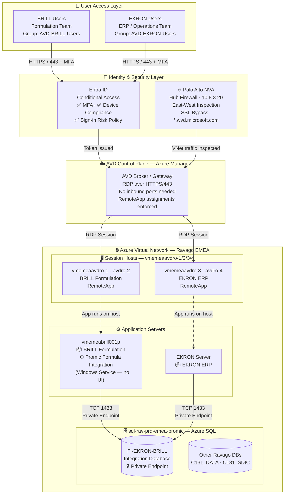
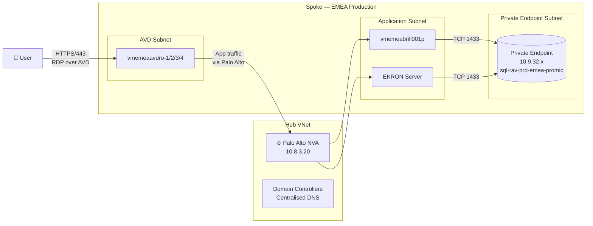
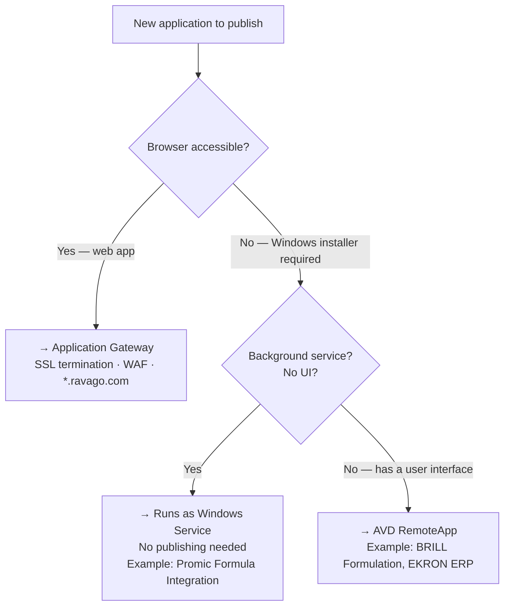
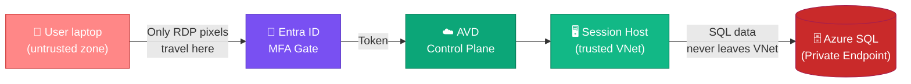

# 🏗️ EKRON · BRILL — Full Architecture Document

> **Classification:** Internal Use Only  
> **Department:** IT Infrastructure  
> **Author:** Carlos Fernández Lara  
> **Version:** 1.0  
> **Date:** 2026-03-17  
> **Status:** ✅ Implemented

[Cegid_ServerKarat_SQL_Migration_Runbook.docx](https://ravagoglobal-my.sharepoint.com/:w:/r/personal/carlos_lara_ravago_com/Documents/SOPs/Cegid_ServerKarat_SQL_Migration_Runbook.docx?d=w39ed2a70fe8843b78427dfa0d9c7a57e&csf=1&web=1&e=yvyStc)
---

## 📋 Table of Contents

1. [[#Overview]]
2. [[#Business Context]]
3. [[#Architecture Diagram]]
4. [[#Servers & Infrastructure]]
5. [[#Applications]]
6. [[#Network Architecture]]
7. [[#Azure SQL Database Layer]]
8. [[#Database Users & Roles]]
9. [[#Application Publishing Strategy]]
10. [[#Identity & Security]]
11. [[#Data Flow]]
12. [[#SQL Reference Scripts]]
13. [[#Decision Log]]
14. [[#Related Documents]]

---

## Overview

The EKRON-BRILL integration connects two independent enterprise systems — the **BRILL Formulation** platform and the **EKRON ERP** — through a shared Azure SQL integration database. The connector component **Promic Formula Integration** acts as the middleware bridge, running as a background Windows service on the BRILL server.

Both applications are fat-client Windows applications published to end users via **Azure Virtual Desktop (AVD) RemoteApp**, ensuring that all SQL traffic remains within the Azure Virtual Network and never touches user devices directly.

---

## Business Context

|Field|Detail|
|---|---|
|**Project sponsor**|Iñaki Larrea|
|**Technical contact**|Carlos Fernández Lara (IT Infrastructure)|
|**Business owner**|GIJS.STINCKENS@RAVAGO.COM|
|**Vendor / Integration**|Promic Formula Integration connector|
|**Scope**|EMEA region|
|**Environment**|Production|

> [!info] Background BRILL Formulation and Promic Formula Integration are installed on a dedicated server `vmemeabrill001p`, independent from the EKRON ERP server. The integration requirement is for EKRON to read and write formulation data through a shared SQL database (`FI-EKRON-BRILL`) hosted on the existing Azure SQL instance `sql-rav-prd-emea-promic`.

---

## Architecture Diagram



---

## Servers & Infrastructure

### vmemeabrill001p — BRILL Application Server

|Property|Value|
|---|---|
|**Hostname**|`vmemeabrill001p`|
|**Role**|BRILL Formulation App Server|
|**OS**|Windows Server|
|**Location**|Azure — EMEA region|
|**Type**|Azure VM (independent from EKRON)|
|**Applications**|BRILL Formulation, Promic Formula Integration|
|**SQL connectivity**|`sql-rav-prd-emea-promic` via Private Endpoint, TCP 1433|
|**Network zone**|Inside Ravago VNet — Palo Alto inspected|

### EKRON Server

|Property|Value|
|---|---|
|**Role**|EKRON ERP Application Server|
|**Type**|Azure VM / On-premises server|
|**Applications**|EKRON ERP (fat client)|
|**SQL connectivity**|`sql-rav-prd-emea-promic` via Private Endpoint, TCP 1433|

### AVD Session Hosts

|Host|OS|RemoteApp Published|Serves|
|---|---|---|---|
|`vmemeaavdro-1`|Windows Server 2022|BRILL Formulation|BRILL Users|
|`vmemeaavdro-2`|Windows Server 2022|BRILL Formulation|BRILL Users|
|`vmemeaavdro-3`|Windows Server 2022|EKRON ERP|EKRON Users|
|`vmemeaavdro-4`|Windows Server 2022|EKRON ERP|EKRON Users|

> [!tip] Why session hosts? Applications are installed **once** on the session hosts. Users connect via AVD RemoteApp and see only the application window — nothing is installed on their laptops. All SQL traffic stays within the Azure VNet.

---

## Applications

### 📦 BRILL Formulation

```
Type        : Fat Client — Windows Desktop Application
Server      : vmemeabrill001p
Published   : AVD RemoteApp (vmemeaavdro-1, vmemeaavdro-2)
Access group: AVD-BRILL-Users
Purpose     : Chemical / polymer formulation management
SQL access  : Indirect — via Promic Formula Integration service
```

> [!important] BRILL Formulation does **not** connect to SQL directly. It interacts with the `FI-EKRON-BRILL` database through the **Promic Formula Integration** Windows service running on the same server.

---

### ⚙️ Promic Formula Integration

```
Type        : Windows Service (background process — no UI)
Server      : vmemeabrill001p
Published   : Not published — runs as a service automatically
Purpose     : Integration connector bridging BRILL ↔ FI-EKRON-BRILL database
SQL login   : FI-EKRON-BRILL_Admin (db_owner)
Protocol    : TCP 1433 → sql-rav-prd-emea-promic (Private Endpoint)
```

> [!warning] No AVD needed Promic Formula Integration is a **headless Windows service**. It has no user interface and does not need to be published via AVD or Application Gateway. It starts automatically on `vmemeabrill001p` and runs continuously.

---

### 📦 EKRON ERP

```
Type        : Fat Client — Windows Desktop Application
Server      : EKRON Server
Published   : AVD RemoteApp (vmemeaavdro-3, vmemeaavdro-4)
Access group: AVD-EKRON-Users
Purpose     : Enterprise Resource Planning
SQL access  : Direct — FI-EKRON-BRILL_User login (db_datareader + db_datawriter)
Protocol    : TCP 1433 → sql-rav-prd-emea-promic (Private Endpoint)
```

---

## Network Architecture

### Topology Overview



### Firewall Rules — Palo Alto NVA

|Rule name|Source|Destination|Port|Action|
|---|---|---|---|---|
|AVD Session Hosts → BRILL Server|AVD subnet|`vmemeabrill001p`|App ports|✅ Allow|
|AVD Session Hosts → EKRON Server|AVD subnet|EKRON Server|App ports|✅ Allow|
|BRILL Server → SQL Private Endpoint|`vmemeabrill001p`|`10.9.32.x`|TCP 1433|✅ Allow|
|EKRON Server → SQL Private Endpoint|EKRON Server|`10.9.32.x`|TCP 1433|✅ Allow|
|SSL Decryption bypass|Any|`*.wvd.microsoft.com`|HTTPS 443|✅ Bypass SSL|

> [!important] SSL Inspection Bypass Palo Alto SSL inspection **must be bypassed** for `*.wvd.microsoft.com`. If SSL inspection intercepts AVD traffic, session host health checks fail and users cannot connect. This bypass rule must exist in Panorama.

### Key Network Facts

|Component|Value|
|---|---|
|**Hub Firewall**|Palo Alto NVA — `10.8.3.20`|
|**DNS**|Centralised via Domain Controllers|
|**SQL Private Endpoint IP**|`10.9.32.x` (internal VNet)|
|**SQL public access**|❌ Disabled|
|**AVD transport**|RDP encapsulated over HTTPS / port 443|
|**SQL port**|TCP 1433|

---

## Azure SQL Database Layer

### Instance

|Property|Value|
|---|---|
|**Server name**|`sql-rav-prd-emea-promic`|
|**Type**|Azure SQL Database (PaaS)|
|**Connectivity**|Private Endpoint only — no public internet access|
|**Region**|EMEA|
|**Authentication**|SQL authentication (mixed mode)|
|**TLS**|Enforced — TLS 1.2 minimum|

> [!note] Azure SQL PaaS behaviour Because this is Azure SQL PaaS (not SQL Server on a VM), there are important differences:
> 
> - `USE [database]` does **not** work — you must connect directly to the target database
> - `CREATE LOGIN` must be run connected to **`master`**
> - `CREATE USER` + role assignments must be run connected to the target database
> - `sys.server_principals` is not available in user databases — `LinkedLogin` will show `NULL` in cross-database queries (expected, not an error)

### Databases

|Database|Purpose|Status|
|---|---|---|
|`FI-EKRON-BRILL`|Integration DB — BRILL ↔ EKRON data exchange|✅ Created|
|`C131_DATA`|Ekon/Cegid ERP data|✅ Migrated from on-prem|
|`C131_SDIC`|Ekon/Cegid supplementary data|✅ Migrated from on-prem|

---

## Database Users & Roles

### FI-EKRON-BRILL

|Login|DB User|Role|Used by|
|---|---|---|---|
|`FI-EKRON-BRILL_Admin`|`FI-EKRON-BRILL_Admin`|`db_owner`|Promic Formula Integration service|
|`FI-EKRON-BRILL_User`|`FI-EKRON-BRILL_User`|`db_datareader` + `db_datawriter`|EKRON ERP connector|

> [!tip] Key Vault Both SQL credentials must be stored in the Ravago Key Vault. Do not store passwords in config files or scripts.

### Verification Queries

**Confirm logins exist — run on `master`:**

```sql
SELECT name, type_desc, default_database_name
FROM sys.sql_logins
WHERE name LIKE 'FI-EKRON-BRILL%';
```

Expected result: both logins returned as `SQL_Login`.

**Confirm role assignments — run on `FI-EKRON-BRILL`:**

```sql
SELECT dp.name AS UserName, r.name AS RoleName
FROM sys.database_role_members rm
JOIN sys.database_principals dp ON rm.member_principal_id = dp.principal_id
JOIN sys.database_principals r  ON rm.role_principal_id   = r.principal_id
WHERE dp.name LIKE 'FI-EKRON-BRILL%';
```

Expected result:

|UserName|RoleName|
|---|---|
|FI-EKRON-BRILL_Admin|db_owner|
|FI-EKRON-BRILL_User|db_datareader|
|FI-EKRON-BRILL_User|db_datawriter|

---

## Application Publishing Strategy

### Why AVD and not Application Gateway?



### Application Gateway Limitation

> [!warning] Application Gateway cannot publish fat clients Application Gateway is a **Layer 7 HTTP/HTTPS reverse proxy**. It can only forward web (browser-based) traffic. It has no ability to proxy RDP connections, SQL connections, or proprietary Windows application protocols. Attempting to publish BRILL or EKRON through Application Gateway will not work.

### AVD Advantages for this Architecture

|Benefit|Detail|
|---|---|
|**SQL traffic stays in VNet**|Session hosts connect to SQL from inside the VNet — traffic never reaches the user's device|
|**Zero client installation**|App installed once on session host — no per-laptop deployments|
|**Central patching**|Update the app once on the session host, all users get it instantly|
|**Credential security**|No SQL credentials or app config files ever touch user laptops|
|**Conditional Access**|Entra ID enforces MFA + device compliance before users reach the session|
|**Palo Alto visibility**|All traffic flows through the hub firewall — full inspection and logging|

---

## Identity & Security

### Entra ID Groups

```
AAD Group: AVD-BRILL-Users
  └── Assigned to: BRILL Formulation RemoteApp Application Group
  └── Members: Formulation team users

AAD Group: AVD-EKRON-Users
  └── Assigned to: EKRON ERP RemoteApp Application Group
  └── Members: ERP / Operations team users

AAD Group: AVD-BRILL-EKRON-Admin
  └── Assigned to: Both application groups
  └── Members: IT Infrastructure, super users
```

### Conditional Access Policy

|Policy setting|Value|
|---|---|
|**Target groups**|AVD-BRILL-Users, AVD-EKRON-Users|
|**Require MFA**|✅ Always|
|**Device compliance**|✅ Require Entra Hybrid Join or Intune compliant|
|**Sign-in risk**|Block if risk = High|
|**Session persistence**|Configurable per group|

### Security Boundaries



> [!success] Key security principle The user's device only ever receives **rendered screen pixels** via RDP. No SQL data, no application binaries, no credentials ever transit the user's laptop. The entire application and data stack runs inside the Azure VNet.

---

## Data Flow

### BRILL User → Formulation Data Flow

```
1. User opens AVD client (browser or Windows app)
2. Entra ID validates identity + enforces MFA + CA policy
3. AVD Broker authenticates and assigns session on vmemeaavdro-1 or avdro-2
4. Session host renders BRILL Formulation application window
5. User interacts with BRILL — screen pixels travel back over RDP/HTTPS
6. BRILL writes formulation data to Promic Formula Integration
7. Promic service connects to FI-EKRON-BRILL database
   → SQL login: FI-EKRON-BRILL_Admin
   → Protocol: TCP 1433 / Private Endpoint
8. Data stored in FI-EKRON-BRILL on sql-rav-prd-emea-promic
```

### EKRON User → Integration Data Flow

```
1. User opens AVD client
2. Entra ID validates identity + enforces MFA + CA policy
3. AVD Broker assigns session on vmemeaavdro-3 or avdro-4
4. Session host renders EKRON ERP application window
5. EKRON reads formulation data from FI-EKRON-BRILL database
   → SQL login: FI-EKRON-BRILL_User
   → Role: db_datareader + db_datawriter
   → Protocol: TCP 1433 / Private Endpoint
6. EKRON processes data and writes results back to FI-EKRON-BRILL
```

---

## SQL Reference Scripts

### Part 1 — Create Logins (run on `master`)

```sql
-- =============================================
-- Run connected to MASTER database
-- Server: sql-rav-prd-emea-promic
-- =============================================

CREATE LOGIN [FI-EKRON-BRILL_Admin] WITH PASSWORD = '<StoreInKeyVault>';
GO

CREATE LOGIN [FI-EKRON-BRILL_User]  WITH PASSWORD = '<StoreInKeyVault>';
GO
```

> [!warning] Azure SQL PaaS restrictions
> 
> - `DEFAULT_DATABASE` clause is **not supported** — removed
> - `CHECK_EXPIRATION` / `CHECK_POLICY` are **not supported** — removed
> - `USE [database]` does **not** switch context — connect directly to target DB

### Part 2 — Create Users & Assign Roles (run on `FI-EKRON-BRILL`)

```sql
-- =============================================
-- Run connected to FI-EKRON-BRILL database
-- =============================================

-- Admin user → db_owner
CREATE USER [FI-EKRON-BRILL_Admin] FOR LOGIN [FI-EKRON-BRILL_Admin];
GO
ALTER ROLE [db_owner] ADD MEMBER [FI-EKRON-BRILL_Admin];
GO

-- R/W user → db_datareader + db_datawriter
CREATE USER [FI-EKRON-BRILL_User] FOR LOGIN [FI-EKRON-BRILL_User];
GO
ALTER ROLE [db_datareader] ADD MEMBER [FI-EKRON-BRILL_User];
ALTER ROLE [db_datawriter] ADD MEMBER [FI-EKRON-BRILL_User];
GO
```

### Part 3 — Verification Queries

```sql
-- === Run on MASTER — confirm logins exist ===
SELECT name, type_desc, default_database_name
FROM sys.sql_logins
WHERE name LIKE 'FI-EKRON-BRILL%';

-- === Run on FI-EKRON-BRILL — confirm users exist ===
SELECT dp.name AS UserName, sp.name AS LinkedLogin, dp.type_desc
FROM sys.database_principals dp
LEFT JOIN sys.server_principals sp ON dp.sid = sp.sid
WHERE dp.name LIKE 'FI-EKRON-BRILL%';
-- Note: LinkedLogin will show NULL — expected in Azure SQL PaaS (not an error)

-- === Run on FI-EKRON-BRILL — confirm role assignments ===
SELECT dp.name AS UserName, r.name AS RoleName
FROM sys.database_role_members rm
JOIN sys.database_principals dp ON rm.member_principal_id = dp.principal_id
JOIN sys.database_principals r  ON rm.role_principal_id   = r.principal_id
WHERE dp.name LIKE 'FI-EKRON-BRILL%';
```

---

## Decision Log

|#|Decision|Rationale|Date|
|---|---|---|---|
|1|Use `sql-rav-prd-emea-promic` for `FI-EKRON-BRILL`|Existing licensed Azure SQL instance — no need for separate SQL Express on `vmemeabrill001p`|2026-03|
|2|SQL Express rejected|10 GB DB limit, no SQL Agent, limited HA — unsuitable for production integration workload|2026-03|
|3|Separate SQL logins per role|Principle of least privilege — Promic gets `db_owner`, EKRON connector gets `db_datareader + db_datawriter` only|2026-03|
|4|Publish via AVD RemoteApp (not App Gateway)|Both BRILL and EKRON are fat Windows clients — App Gateway only handles HTTP/HTTPS and cannot proxy proprietary protocols|2026-03|
|5|Promic runs as Windows Service|No user-facing UI — does not need to be published; runs headlessly on `vmemeabrill001p` at all times|2026-03|
|6|Private Endpoint for SQL|SQL server must not be exposed to internet — all connectivity via VNet private endpoint|2026-03|

---

## Related Documents

- [[EKRON-BRILL-Architecture]] — Obsidian Canvas architecture diagram
- [[EKRON-BRILL-AVD-Architecture]] — Excalidraw detailed AVD diagram
- [[Application-Publishing-Strategy]] — Fat client vs web app publishing guide
- [[Azure SQL — sql-rav-prd-emea-promic]] — SQL instance documentation
- [[Palo Alto Firewall — AVD SSL Bypass Rules]] — SSL decryption bypass runbook
- [[Azure Virtual Desktop — Architecture]] — AVD infrastructure overview

---

_Document maintained by IT Infrastructure — Ravago EMEA_  
_For changes contact: Carlos Fernández Lara_