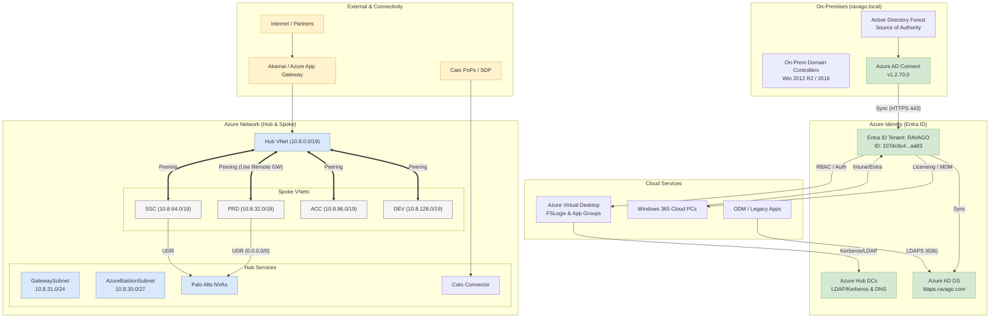

# 🔐 Identity & Hybrid Identity Architecture (Ravago)

Ravago operates a **fully hybrid identity model**, where **all user and group identities originate on‑premises** in the central **ravago.local Active Directory forest**, and are **synchronized to Azure (Entra ID)** using **Azure AD Connect**. This model ensures that authentication, authorization, and group‑based access remain **centrally governed** while enabling **modern cloud capabilities**.

---

## 1. Hybrid Identity Foundation

### **Azure AD Connect is deployed and active**

- Azure AD Connect was installed earlier in the environment; documentation confirms _“AD Connect was installed… Version 1.2.70.0”_ and is synchronizing on‑prem AD identities into Azure AD (Entra ID).  
    [[RAVAGO - H...e - Design | Word]](https://ravagoglobal.sharepoint.com/sites/GlobalIT-Infra-Team/_layouts/15/Doc.aspx?sourcedoc=%7B51847B19-7BCD-4939-BDE4-F365A8D21E9D%7D&file=RAVAGO%20-%20Hybrid%20Exchange%20-%20Design.docx&action=default&mobileredirect=true&DefaultItemOpen=1)

### **Identity flow**

```
On‑prem AD (ravago.local)
        ↓  (sync of users, groups, password hashes)
Azure AD / Entra ID Tenant (ravago)
```

### **Hybrid identity use cases enabled**

- Password hash sync
- Group sync (used heavily for AVD, application access, PIM, etc.)
- Seamless SSO (Kerberos is used per AAD Connect port requirements)  
    [[RAVAGO - H...e - Design | Word]](https://ravagoglobal.sharepoint.com/sites/GlobalIT-Infra-Team/_layouts/15/Doc.aspx?sourcedoc=%7B51847B19-7BCD-4939-BDE4-F365A8D21E9D%7D&file=RAVAGO%20-%20Hybrid%20Exchange%20-%20Design.docx&action=default&mobileredirect=true&DefaultItemOpen=1)

---

## 2. On‑Prem Active Directory Structure

### **Central forest: ravago.local**

- Uses a structured OU design with custom policies replacing default GPOs.  
    [[Ravago - D...ructure v1 | Word]](https://ravagoglobal.sharepoint.com/sites/GlobalIT-Infra-Team/_layouts/15/Doc.aspx?sourcedoc=%7BC927BECC-F379-4998-830A-3E7C118CD3B7%7D&file=Ravago%20-%20Design%20-%20Active%20Directory%20OU%20and%20GPO%20Structure%20v1.docx&action=default&mobileredirect=true&DefaultItemOpen=1)

### **Domain Controllers**

- Mix of Windows Server 2012 R2 and 2016.
- DCs are also deployed **in the Azure Hub** to provide line‑of‑sight LDAP/Kerberos authentication for Azure workloads.
- These Azure‑hosted DCs are also used as internal DNS servers for AVD and hub/spoke workloads.  
    (inferred from AVD doc: AVD VNets point to Azure DC IPs **10.9.210.4** / **10.9.210.5**)  
    [[Ravago - A...umentation | Word]](https://ravagoglobal.sharepoint.com/sites/GlobalIT-Infra-Team/_layouts/15/Doc.aspx?sourcedoc=%7B4019DEC7-AE80-41F9-B227-441C635916C1%7D&file=Ravago%20-%20Azure%20Virtual%20Desktop%20-%20Technical%20Documentation.docx&action=default&mobileredirect=true&DefaultItemOpen=1)

---

## 3. DNS, Authentication & Directory‑related Connectivity

### **DNS Requirements**

Azure AD Connect requires DNS resolution to **both** on‑prem AD and Azure AD endpoints.  
[[RAVAGO - H...e - Design | Word]](https://ravagoglobal.sharepoint.com/sites/GlobalIT-Infra-Team/_layouts/15/Doc.aspx?sourcedoc=%7B51847B19-7BCD-4939-BDE4-F365A8D21E9D%7D&file=RAVAGO%20-%20Hybrid%20Exchange%20-%20Design.docx&action=default&mobileredirect=true&DefaultItemOpen=1)

### **Authentication protocols**

The following on‑prem protocols are used to support hybrid identity:

|Protocol|Purpose|
|---|---|
|Kerberos 88|Authentication to on‑prem AD|
|LDAP 389 / LDAPS 636|Directory reads + encrypted LDAPS sync|
|RPC 445 & high RPC ports|Password sync, initial binding, Seamless SSO|
|HTTPS 443|Sync to Azure AD|
|HTTP 80|CRL checks for Azure AD endpoints|

[[RAVAGO - H...e - Design | Word]](https://ravagoglobal.sharepoint.com/sites/GlobalIT-Infra-Team/_layouts/15/Doc.aspx?sourcedoc=%7B51847B19-7BCD-4939-BDE4-F365A8D21E9D%7D&file=RAVAGO%20-%20Hybrid%20Exchange%20-%20Design.docx&action=default&mobileredirect=true&DefaultItemOpen=1)

---

## 4. Azure AD / Entra ID Tenant

### **Tenant Details**

Identity tenant documented with:

- **Tenant Name**: RAVAGO
- **Tenant ID**: `107dc6c4-f72f-4c49-8db5-76ac9832aa83`  
    

### **Role‑Based Access Control & Governance**

- Role assignments follow least‑privilege principle.
- RBAC is assigned at **tenant → management group → subscription → resource group** layers.
- PIM **is NOT currently used**; roles are permanently assigned.  
    

---

## 5. Cloud Services Depending on Hybrid Identity

### **Azure Virtual Desktop (AVD)**

- AVD user access is controlled using **Windows Security Groups synchronized to Azure AD via AAD Connect.**  
    Example: `SG-AZURE-AVD-APPLICATION-USER`.  
    

### **Windows 365 Cloud PCs**

- Relies heavily on Entra ID identity for provisioning, licensing, and MDM (Intune).  
    

### **Azure AD DS (Domain Services) for specific workloads**

- LDAPS endpoint (`ldaps.ravago.com` on port 636) is used by specific apps like ODM.
    - Users and groups stored under `OU=AADDC Users,DC=ravago,DC=com`  
        

---

## 6. Group-Based Access Management

### **AD Groups → Synced → Azure AD Groups → Used for:**

- AVD application permissions  
    [[WI_Ravago...indows 365 | Word]](https://ravagoglobal.sharepoint.com/sites/GlobalIT-Infra-Team/_layouts/15/Doc.aspx?sourcedoc=%7BA7007E34-B412-4CF8-8F3C-92F6298D5C9F%7D&file=WI_Ravago%20Connected%20Workplace%20-%20Windows%20365.docx&action=default&mobileredirect=true&DefaultItemOpen=1)
- FSLogix access and storage permissions  
    [[WI_Ravago...indows 365 | Word]](https://ravagoglobal.sharepoint.com/sites/GlobalIT-Infra-Team/_layouts/15/Doc.aspx?sourcedoc=%7BA7007E34-B412-4CF8-8F3C-92F6298D5C9F%7D&file=WI_Ravago%20Connected%20Workplace%20-%20Windows%20365.docx&action=default&mobileredirect=true&DefaultItemOpen=1)
- Role assignments and IAM in Azure (network mgmt, app mgmt, etc.)  
    [[Ravago AVD...umentation | Word]](https://ravagoglobal.sharepoint.com/sites/GlobalIT-Infra-Team/_layouts/15/Doc.aspx?sourcedoc=%7BD999F629-6D13-4056-BFFB-261DDC95C6E4%7D&file=Ravago%20AVD%20documentation.docx&action=default&mobileredirect=true&DefaultItemOpen=1)
- Application access (e.g., ODM groups in Azure AD DS)  
    

---

## 7. Conditional Access & Security Controls

### **Conditional Access**

- Currently **no additional CA policies** are applied beyond RBAC.  
    [[Ravago AVD...umentation | Word]](https://ravagoglobal.sharepoint.com/sites/GlobalIT-Infra-Team/_layouts/15/Doc.aspx?sourcedoc=%7BD999F629-6D13-4056-BFFB-261DDC95C6E4%7D&file=Ravago%20AVD%20documentation.docx&action=default&mobileredirect=true&DefaultItemOpen=1)

### **Azure Policy**

Identity‑related guardrails such as:

- Enforcing HTTPS only
- Enforcing SSL on functions
- Denying HTTP on storage  
    These indirectly protect identity‑driven access paths.  
    [[Ravago AVD...umentation | Word]](https://ravagoglobal.sharepoint.com/sites/GlobalIT-Infra-Team/_layouts/15/Doc.aspx?sourcedoc=%7BD999F629-6D13-4056-BFFB-261DDC95C6E4%7D&file=Ravago%20AVD%20documentation.docx&action=default&mobileredirect=true&DefaultItemOpen=1)

---

## 8. High‑Level Identity Architecture Diagram (Textual)

```
                +----------------------------+
                |    On-Prem AD (ravago.local)
                |    - Users
                |    - Groups
                |    - GPOs / OU structure
                +----------------------------+
                           |
                           |  (Azure AD Connect)
                           v
                +----------------------------+
                | Entra ID (Azure AD)
                |  - Hybrid identities
                |  - RBAC / IAM
                |  - Conditional Access
                |  - Group-based access
                +----------------------------+
                           |
                 +---------+---------+
                 |                   |
       +----------------+   +-----------------+
       | Azure AD DS    |   | Azure Services  |
       | (LDAPS workloads)|   | (AVD, W365, PEs)|
       +----------------+   +-----------------+
```

---

# ✅ Summary (for your global picture)

- **YES — Ravago is a hybrid environment.**  
    All identities originate **on‑prem** and synchronize to **Entra ID** using **Azure AD Connect**.
    
- **Identity is central to every major cloud service**, including AVD, Windows 365, FSLogix, SFTP access patterns, IAM roles, and application access.
    
- **Azure DCs in the hub** provide DNS/Kerberos for Azure workloads, ensuring seamless hybrid authentication.
    
- **Azure AD DS** is used for specific applications requiring LDAP/LDAPS.
    
- **RBAC is strictly governed** at multiple scopes with least‑privilege enforcement.
    


# Ravago Azure Infrastructure — High‑Level Design (Updated with Identity)

## 1) Executive Summary

Ravago runs a **hub‑and‑spoke landing zone** in Azure with **regional hubs** (notably **EMEA in West Europe**, **AMER in East US 2**) that centralize security, connectivity, and management. **Spoke VNets** host workloads for **Production, Acceptance, Development, and Shared Services** and are peered to their regional hub. **Traffic steering** leverages **Palo Alto NVAs** and integrates with **Cato** for SD‑WAN/SASE; **Azure Bastion** provides secure remote access. **Active Directory domain controllers** are hosted in Azure for line‑of‑sight authentication and DNS; **Azure Private DNS** supports private name resolution and Private Link patterns. Governance uses **management groups, subscriptions, RBAC, and Azure Policy**; deployments are delivered by **Arxus via Terraform** under IT Infra governance. [[WI_RAVAGO_...DEPLOYMENT | Word]](https://ravagoglobal.sharepoint.com/sites/GlobalIT-Infra-Team/_layouts/15/Doc.aspx?sourcedoc=%7BB09B9415-744D-405E-B33B-0EB569F77505%7D&file=WI_RAVAGO_VM_WINTEL_DEPLOYMENT.docx&action=default&mobileredirect=true&DefaultItemOpen=1), [[Reference...rV-Cluster | Word]](https://ravagoglobal.sharepoint.com/sites/GlobalIT-Infra-Team/_layouts/15/Doc.aspx?sourcedoc=%7B5796A9F3-00C1-405C-B714-79303329AC3A%7D&file=Reference%20Design%20-%20HyperV-Cluster.docx&action=default&mobileredirect=true&DefaultItemOpen=1), [[Windows365...for_Ravago | Word]](https://ravagoglobal.sharepoint.com/sites/GlobalIT-Infra-Team/_layouts/15/Doc.aspx?sourcedoc=%7BD4B31B9E-30A1-4EAF-8912-2D1AE23CF192%7D&file=Windows365_Arch_Design_for_Ravago.docx&action=default&mobileredirect=true&DefaultItemOpen=1), [[DS_8360Series | PDF]](https://ravagoglobal.sharepoint.com/sites/GlobalIT-Infra-Team/Shared%20Documents/Locations/BR%20-%20Brazil/BR-JUN%20%20-%20Vidara%20-%20Brazil/IT%20Operations/01%20-%20Projects/IT4IT%20-%20Switches%20Aruba%20DC/Custos/Agis/DS_8360Series.pdf?web=1), [[WI_DigiCer...ertCentral | Word]](https://ravagoglobal.sharepoint.com/sites/GlobalIT-Infra-Team/_layouts/15/Doc.aspx?sourcedoc=%7BFCC8B338-868D-4C31-8F01-67F0025DE05A%7D&file=WI_DigiCert_CertCentral.docx&action=default&mobileredirect=true&DefaultItemOpen=1)

---

## 2) Regions, Landing Zone & Governance

- **Active regions / geos:** Azure presence in **West Europe (EMEA)** and **East US 2 (AMER)** under the Cloud‑First program. [[DS_8360Series | PDF]](https://ravagoglobal.sharepoint.com/sites/GlobalIT-Infra-Team/Shared%20Documents/Locations/BR%20-%20Brazil/BR-JUN%20%20-%20Vidara%20-%20Brazil/IT%20Operations/01%20-%20Projects/IT4IT%20-%20Switches%20Aruba%20DC/Custos/Agis/DS_8360Series.pdf?web=1)
- **Landing zone pattern:** Standard **hub‑and‑spoke**, with shared services in the **hub** and environment‑scoped **spokes** (PRD/ACC/DEV/SSC). The **EMEA as‑built** document lists concrete VNet ranges, subnets, and peerings. [[WI_RAVAGO_...DEPLOYMENT | Word]](https://ravagoglobal.sharepoint.com/sites/GlobalIT-Infra-Team/_layouts/15/Doc.aspx?sourcedoc=%7BB09B9415-744D-405E-B33B-0EB569F77505%7D&file=WI_RAVAGO_VM_WINTEL_DEPLOYMENT.docx&action=default&mobileredirect=true&DefaultItemOpen=1)
- **Management groups & subscriptions:** Hierarchy separates **geo** and **environment** (e.g., `mg-ssc-emea`, `mg-emea-prd`, `mg-emea-non-prd`) with subscriptions aligned to application categorization. [[WI_Azure_V...nal_users) | Word]](https://ravagoglobal.sharepoint.com/sites/GlobalIT-Infra-Team/_layouts/15/Doc.aspx?sourcedoc=%7B219FB90C-EFCF-487B-86BF-04F4D194367B%7D&file=WI_Azure_Virtual_Desktop_\(External_users\).docx&action=default&mobileredirect=true&DefaultItemOpen=1)
- **Delivery model:** Deployments are executed by **Arxus** (monitoring, backup, automation) using **Terraform**; IT Infra retains **RBAC/governance** control. [[DS_8360Series | PDF]](https://ravagoglobal.sharepoint.com/sites/GlobalIT-Infra-Team/Shared%20Documents/Locations/BR%20-%20Brazil/BR-JUN%20%20-%20Vidara%20-%20Brazil/IT%20Operations/01%20-%20Projects/IT4IT%20-%20Switches%20Aruba%20DC/Custos/Agis/DS_8360Series.pdf?web=1)

---

## 3) Global Addressing & IPAM

- **Corporate plan:** RFC1918 **10.0.0.0/8** with **regional blocks**; **10.8.0.0/16** and **10.9.0.0/16** reserved for **EMEA Azure**, **10.19.0.0/16** reserved for **AMER Azure**. IP allocations are tracked in **IPAM**. [[Azure_Serv...o_BEAM_DEV | Excel]](https://ravagoglobal-my.sharepoint.com/personal/carlos_lara_ravago_com/_layouts/15/Doc.aspx?sourcedoc=%7B4BDB459B-02E8-4CF9-8E58-54CFC46DFD29%7D&file=Azure_Server_Request_Sheet_Ravago_BEAM_DEV.xlsx&action=default&mobileredirect=true&DefaultItemOpen=1)

---

## 4) Connectivity & Perimeter

- **Public ingress:** Standard pattern via **Azure Application Gateway** and **Akamai** (front‑door/WAF), with clear deployment steps for Digital Platform channels. [[Ravago - L...s-Built v2 | Word]](https://ravagoglobal.sharepoint.com/sites/GlobalIT-Infra-Team/_layouts/15/Doc.aspx?sourcedoc=%7B84EF935B-1838-49D5-BA6D-9389E8644A5B%7D&file=Ravago%20-%20Landing%20Zone%20As-Built%20v2.docx&action=default&mobileredirect=true&DefaultItemOpen=1)
- **WAN / SD‑WAN / Remote users:** **Cato SDP** is the target for RCW users; **GlobalProtect** remains for OT/legacy access. Site types and roadmap are defined in **RavNet SOE Networking**. [[Windows365...for_Ravago | Word]](https://ravagoglobal.sharepoint.com/sites/GlobalIT-Infra-Team/_layouts/15/Doc.aspx?sourcedoc=%7BD4B31B9E-30A1-4EAF-8912-2D1AE23CF192%7D&file=Windows365_Arch_Design_for_Ravago.docx&action=default&mobileredirect=true&DefaultItemOpen=1)
- **Hub egress & inspection:** **Palo Alto NVAs** provide north‑south/east‑west inspection; **UDRs/route tables** in hub subnets steer traffic to Palo Alto or **Cato** as appropriate (e.g., `rt-vnet-rav-hub-emea-snet-priv-01` to Palo Alto; `…-priv-02` to Cato). [[Reference...rV-Cluster | Word]](https://ravagoglobal.sharepoint.com/sites/GlobalIT-Infra-Team/_layouts/15/Doc.aspx?sourcedoc=%7B5796A9F3-00C1-405C-B714-79303329AC3A%7D&file=Reference%20Design%20-%20HyperV-Cluster.docx&action=default&mobileredirect=true&DefaultItemOpen=1)
- **Private connectivity pattern:** The landing‑zone baseline includes **ExpressRoute gateway** support and **IPsec VPN** for remote sites without MPLS; hairpinning considerations are documented. _(Use case‑dependent per region.)_ [[WI_RAVAGO_...DEPLOYMENT | Word]](https://ravagoglobal.sharepoint.com/sites/GlobalIT-Infra-Team/_layouts/15/Doc.aspx?sourcedoc=%7B89DC1C8C-1422-4AB8-BDEA-837C61388AED%7D&file=WI_RAVAGO_VM_WINTEL_DEPLOYMENT.docx&action=default&mobileredirect=true&DefaultItemOpen=1)

---

## 5) Network Topology (EMEA Hub‑and‑Spoke)

**Core VNets (as‑built):**

|VNet|Address space|Purpose|
|---|---|---|
|`vnet-rav-hub-emea`|**10.8.0.0/19**|Regional hub (security, connectivity, mgmt)|
|`vnet-rav-prd-emea`|**10.8.32.0/19**|Production spoke|
|`vnet-rav-ssc-emea`|**10.8.64.0/19**|Shared Services spoke|
|`vnet-rav-acc-emea`|**10.8.96.0/19**|Acceptance spoke|
|`vnet-rav-dev-emea`|**10.8.128.0/19**|Development spoke|
|[[WI_RAVAGO_...DEPLOYMENT \| Word]](https://ravagoglobal.sharepoint.com/sites/GlobalIT-Infra-Team/_layouts/15/Doc.aspx?sourcedoc=%7BB09B9415-744D-405E-B33B-0EB569F77505%7D&file=WI_RAVAGO_VM_WINTEL_DEPLOYMENT.docx&action=default&mobileredirect=true&DefaultItemOpen=1)|||

**Representative hub subnets** include `GatewaySubnet` (**10.8.31.0/24**), `AzureBastionSubnet` (**10.8.30.0/27**), and dedicated management subnets; SSC has its own Bastion and management subnets as well. [[WI_RAVAGO_...DEPLOYMENT | Word]](https://ravagoglobal.sharepoint.com/sites/GlobalIT-Infra-Team/_layouts/15/Doc.aspx?sourcedoc=%7BB09B9415-744D-405E-B33B-0EB569F77505%7D&file=WI_RAVAGO_VM_WINTEL_DEPLOYMENT.docx&action=default&mobileredirect=true&DefaultItemOpen=1)

**Peering & gateway use:** Spokes are peered **to the hub** with **Allow forwarded traffic** and **Use remote gateways** as needed. [[WI_RAVAGO_...DEPLOYMENT | Word]](https://ravagoglobal.sharepoint.com/sites/GlobalIT-Infra-Team/_layouts/15/Doc.aspx?sourcedoc=%7BB09B9415-744D-405E-B33B-0EB569F77505%7D&file=WI_RAVAGO_VM_WINTEL_DEPLOYMENT.docx&action=default&mobileredirect=true&DefaultItemOpen=1)

**Routing examples:** Route tables in the hub direct specific subnets to **Palo Alto** or **Cato**; partner/customer routes (e.g., **Ambra/Kimteks**) are documented in Infra notes. [[Reference...rV-Cluster | Word]](https://ravagoglobal.sharepoint.com/sites/GlobalIT-Infra-Team/_layouts/15/Doc.aspx?sourcedoc=%7B5796A9F3-00C1-405C-B714-79303329AC3A%7D&file=Reference%20Design%20-%20HyperV-Cluster.docx&action=default&mobileredirect=true&DefaultItemOpen=1)

---

## 6) Network Topology (AMER — high‑level)

- **Region:** **East US 2** under Cloud‑First. Same **hub‑and‑spoke** model is applied. [[DS_8360Series | PDF]](https://ravagoglobal.sharepoint.com/sites/GlobalIT-Infra-Team/Shared%20Documents/Locations/BR%20-%20Brazil/BR-JUN%20%20-%20Vidara%20-%20Brazil/IT%20Operations/01%20-%20Projects/IT4IT%20-%20Switches%20Aruba%20DC/Custos/Agis/DS_8360Series.pdf?web=1)
- **Addressing:** **10.19.0.0/16** reserved for **AMER Azure** per the corporate IP plan. [[Azure_Serv...o_BEAM_DEV | Excel]](https://ravagoglobal-my.sharepoint.com/personal/carlos_lara_ravago_com/_layouts/15/Doc.aspx?sourcedoc=%7B4BDB459B-02E8-4CF9-8E58-54CFC46DFD29%7D&file=Azure_Server_Request_Sheet_Ravago_BEAM_DEV.xlsx&action=default&mobileredirect=true&DefaultItemOpen=1)
- **Baseline pattern:** Mirrors the landing‑zone reference (hub with ER/VPN gateway support, spokes per environment). [[WI_RAVAGO_...DEPLOYMENT | Word]](https://ravagoglobal.sharepoint.com/sites/GlobalIT-Infra-Team/_layouts/15/Doc.aspx?sourcedoc=%7B89DC1C8C-1422-4AB8-BDEA-837C61388AED%7D&file=WI_RAVAGO_VM_WINTEL_DEPLOYMENT.docx&action=default&mobileredirect=true&DefaultItemOpen=1)

---

## 7) Identity & Hybrid Identity (Authoritative)

### 7.1 Hybrid identity model

- Ravago runs a **fully hybrid identity**: **on‑prem AD (ravago.local)** is the **source of authority**; users & groups are **synced to Entra ID** using **Azure AD Connect**. [[SAP_B1_ROM...(Repaired) | Word]](https://ravagoglobal-my.sharepoint.com/personal/carlos_lara_ravago_com/_layouts/15/Doc.aspx?sourcedoc=%7B5F686641-5A7B-400F-A631-0AB7A319B3B4%7D&file=SAP_B1_ROM_HANA_Infrastructure%20\(Repaired\).docx&action=default&mobileredirect=true&DefaultItemOpen=1)

### 7.2 Azure AD Connect status & ports

- **AAD Connect installed** (doc refers to version **1.2.70.0**); requires DNS to on‑prem AD and to Azure endpoints.
- Protocols/ports in use include **Kerberos 88**, **LDAP/LDAPS 389/636**, **RPC 445 + high ports**, **HTTPS 443**, **HTTP 80 (CRL)**. [[SAP_B1_ROM...(Repaired) | Word]](https://ravagoglobal-my.sharepoint.com/personal/carlos_lara_ravago_com/_layouts/15/Doc.aspx?sourcedoc=%7B5F686641-5A7B-400F-A631-0AB7A319B3B4%7D&file=SAP_B1_ROM_HANA_Infrastructure%20\(Repaired\).docx&action=default&mobileredirect=true&DefaultItemOpen=1)

### 7.3 Tenant & RBAC

- **Tenant**: **RAVAGO** (Tenant ID **107dc6c4‑f72f‑4c49‑8db5‑76ac9832aa83**). [[Azure_Serv...o_BEAM_DEV | Excel]](https://ravagoglobal-my.sharepoint.com/personal/carlos_lara_ravago_com/_layouts/15/Doc.aspx?sourcedoc=%7B4BDB459B-02E8-4CF9-8E58-54CFC46DFD29%7D&file=Azure_Server_Request_Sheet_Ravago_BEAM_DEV.xlsx&action=default&mobileredirect=true&DefaultItemOpen=1)
- **RBAC & scopes**: Roles assigned at tenant/mg/subscription/RG with **least privilege**; **as‑built** notes **PIM not used** centrally (roles directly assigned). _(See “PIM usage varies” note below.)_ [[C2305-00528-44-14 | PDF]](https://ravagoglobal.sharepoint.com/sites/GlobalIT-Infra-Team/Shared%20Documents/SOE%20IT%20Servicedesk/Talos-Intune-Discussion-data/TD-Change-Export/C2305-00528/C2305-00528-44-14.pdf?web=1)

### 7.4 Domain controllers & DNS in Azure

- **DCs deployed in the hub** provide line‑of‑sight **Kerberos/LDAP** and **DNS** to Azure workloads.
- Example (EMEA/AVD): VNets use **Azure DC IPs `10.9.210.4` / `10.9.210.5`** as DNS servers. [[WI_DigiCer...ertCentral | Word]](https://ravagoglobal.sharepoint.com/sites/GlobalIT-Infra-Team/_layouts/15/Doc.aspx?sourcedoc=%7BFCC8B338-868D-4C31-8F01-67F0025DE05A%7D&file=WI_DigiCert_CertCentral.docx&action=default&mobileredirect=true&DefaultItemOpen=1)

### 7.5 Azure AD DS (managed domain) for specific apps

- Example: **ODM** binds via **LDAPS** to **`ldaps.ravago.com`** (**10.8.0.36**, port **636**), using `OU=AADDC Users,DC=ravago,DC=com` for users/groups.

### 7.6 Group‑based access end‑to‑end

- **AD groups** sync to Entra ID and control access to **AVD** (e.g., `SG-AZURE-AVD-APPLICATION-USER`) and **FSLogix** shares/roles. [[Ravago_PAL...x_20201203 | Word]](https://ravagoglobal.sharepoint.com/sites/GlobalIT-Infra-Team/_layouts/15/Doc.aspx?sourcedoc=%7BEEC70069-D992-45B7-95F9-CD5F70D976FB%7D&file=Ravago_PALO_ALTO_Appendix_20201203.docx&action=default&mobileredirect=true&DefaultItemOpen=1)
- **Azure RBAC** assignments leverage synced groups (network/app/admin scopes). [[C2305-00528-44-14 | PDF]](https://ravagoglobal.sharepoint.com/sites/GlobalIT-Infra-Team/Shared%20Documents/SOE%20IT%20Servicedesk/Talos-Intune-Discussion-data/TD-Change-Export/C2305-00528/C2305-00528-44-14.pdf?web=1)

### 7.7 Conditional Access & PIM

- **Conditional Access**: The **as‑built** explicitly states **no additional CA** beyond role assignments. [[C2305-00528-44-14 | PDF]](https://ravagoglobal.sharepoint.com/sites/GlobalIT-Infra-Team/Shared%20Documents/SOE%20IT%20Servicedesk/Talos-Intune-Discussion-data/TD-Change-Export/C2305-00528/C2305-00528-44-14.pdf?web=1)
- **PIM**: **As‑built** indicates **PIM not used** centrally; however, **some work instructions** (e.g., **Azure Communication Services**) reference **activating PIM‑eligible roles** for specific operations—treat this as **workload‑specific**, not a global standard. [[C2305-00528-44-14 | PDF]](https://ravagoglobal.sharepoint.com/sites/GlobalIT-Infra-Team/Shared%20Documents/SOE%20IT%20Servicedesk/Talos-Intune-Discussion-data/TD-Change-Export/C2305-00528/C2305-00528-44-14.pdf?web=1), [[INFRA_2019_6 | PowerPoint]](https://ravagoglobal.sharepoint.com/sites/GlobalIT-Infra-Team/_layouts/15/Doc.aspx?sourcedoc=%7B4EAE71DC-497D-4219-8EA5-B9E2366F9068%7D&file=INFRA_2019_6.pptx&action=edit&mobileredirect=true&DefaultItemOpen=1)

### 7.8 AD design standards

- OU/GPO model follows Microsoft baselines (2012 R2/2016), with defaults **left untouched** and settings applied via **custom GPOs**.

---

## 8) Name Resolution & Private Connectivity

- **Azure Private DNS** is used for private name resolution within VNets and for Private Link patterns (e.g., platform zones like Vault/Storage). AVD documentation explicitly calls out **Azure Private DNS** for internal resolution. [[WI_DigiCer...ertCentral | Word]](https://ravagoglobal.sharepoint.com/sites/GlobalIT-Infra-Team/_layouts/15/Doc.aspx?sourcedoc=%7BFCC8B338-868D-4C31-8F01-67F0025DE05A%7D&file=WI_DigiCert_CertCentral.docx&action=default&mobileredirect=true&DefaultItemOpen=1)
- **Private Endpoints** are routed privately via hub UDRs/inspection; route tables document black‑holes and partner routes where required. [[Reference...rV-Cluster | Word]](https://ravagoglobal.sharepoint.com/sites/GlobalIT-Infra-Team/_layouts/15/Doc.aspx?sourcedoc=%7B5796A9F3-00C1-405C-B714-79303329AC3A%7D&file=Reference%20Design%20-%20HyperV-Cluster.docx&action=default&mobileredirect=true&DefaultItemOpen=1)

---

## 9) Platform & Workloads (Illustrative, not exhaustive)

- **Azure Virtual Desktop (AVD):** Per‑region VNets, Azure DC‑backed DNS, **AVD Insights** to **Log Analytics**, and **Arxus extended monitoring**. [[Azure_Serv...o_BEAM_DEV | Excel]](https://ravagoglobal-my.sharepoint.com/personal/carlos_lara_ravago_com/_layouts/15/Doc.aspx?sourcedoc=%7B4BDB459B-02E8-4CF9-8E58-54CFC46DFD29%7D&file=Azure_Server_Request_Sheet_Ravago_BEAM_DEV.xlsx&action=default&mobileredirect=true&DefaultItemOpen=1)
- **Windows 365 (Cloud PCs):** Provisioned per RCW requirements; **Azure Network Connection** VNets are used **only when direct RavNet connectivity is needed**; otherwise Microsoft‑managed networking. [[WI_Ravago...Enrollment | Word]](https://ravagoglobal.sharepoint.com/sites/GlobalIT-Infra-Team/_layouts/15/Doc.aspx?sourcedoc=%7BDB0FB186-5F03-4C10-8F93-A937750ABCA8%7D&file=WI_Ravago%20Connected%20Workplace%20-%20MacOS%20Enrollment.docx&action=default&mobileredirect=true&DefaultItemOpen=1)
- **Azure Storage SFTP:** Standardized solution with **container‑scoped permissions**, enforced security defaults (TLS 1.2, no anon blob), and soft‑delete. **Per‑party containers** and user naming are defined. [[WI_RAVAGO_...gistration | Word]](https://ravagoglobal.sharepoint.com/sites/GlobalIT-Infra-Team/_layouts/15/Doc.aspx?sourcedoc=%7B41CD063C-5E01-40A5-BFD7-760527498327%7D&file=WI_RAVAGO_SelfServicePasswordReset_Registration.docx&action=default&mobileredirect=true&DefaultItemOpen=1)
- **SAP B1 ROM (example):** Production spoke with defined app/database VMs and **connectivity via EMEA hub firewall + Cato**; requires route‑propagation overrides to avoid direct peering routes. [[WI_Azure_V...nal_users) | Word]](https://ravagoglobal.sharepoint.com/sites/GlobalIT-Infra-Team/_layouts/15/Doc.aspx?sourcedoc=%7BACEEA432-9916-415A-A8B2-127B5370F59E%7D&file=WI_Azure_Virtual_Desktop_\(External_users\).docx&action=default&mobileredirect=true&DefaultItemOpen=1)

---

## 10) Security, Governance & Standards

- **RBAC & scopes:** Role assignments at tenant/mg/subscription/RG with least privilege; **as‑built shows direct assignments (no PIM)**. [[C2305-00528-44-14 | PDF]](https://ravagoglobal.sharepoint.com/sites/GlobalIT-Infra-Team/Shared%20Documents/SOE%20IT%20Servicedesk/Talos-Intune-Discussion-data/TD-Change-Export/C2305-00528/C2305-00528-44-14.pdf?web=1)
- **Azure Policy (selected):** Allowed locations; **deny HTTP** on storage/apps; **enforce HTTPS/SSL** on web/functions; **append tags** from RG—applied at `mg-it`. [[C2305-00528-44-14 | PDF]](https://ravagoglobal.sharepoint.com/sites/GlobalIT-Infra-Team/Shared%20Documents/SOE%20IT%20Servicedesk/Talos-Intune-Discussion-data/TD-Change-Export/C2305-00528/C2305-00528-44-14.pdf?web=1)
- **Naming standards:** Enforced for AD/AAD/Azure resources; VM work instructions point to the **Standard Naming Convention** doc. [[Ravago AVD...umentation | Word]](https://ravagoglobal.sharepoint.com/sites/GlobalIT-Infra-Team/_layouts/15/Doc.aspx?sourcedoc=%7BD999F629-6D13-4056-BFFB-261DDC95C6E4%7D&file=Ravago%20AVD%20documentation.docx&action=default&mobileredirect=true&DefaultItemOpen=1), [[Ravago_SAP_Hld_v1.1 | Word]](https://ravagoglobal.sharepoint.com/sites/GlobalIT-Infra-Team/_layouts/15/Doc.aspx?sourcedoc=%7B9574B9BB-8753-4076-BA07-8B5854831A95%7D&file=Ravago_SAP_Hld_v1.1.docx&action=default&mobileredirect=true&DefaultItemOpen=1)
- **Network standard:** **STD_Network** defines the global IP plan, site types, and design principles for **RavNet**. [[Azure_Serv...o_BEAM_DEV | Excel]](https://ravagoglobal-my.sharepoint.com/personal/carlos_lara_ravago_com/_layouts/15/Doc.aspx?sourcedoc=%7B4BDB459B-02E8-4CF9-8E58-54CFC46DFD29%7D&file=Azure_Server_Request_Sheet_Ravago_BEAM_DEV.xlsx&action=default&mobileredirect=true&DefaultItemOpen=1)

---

## 11) Monitoring & Operations

- **AVD monitoring** via **Insights** + **Log Analytics**; **Arxus extended monitoring** for proactive remediations. [[Azure_Serv...o_BEAM_DEV | Excel]](https://ravagoglobal-my.sharepoint.com/personal/carlos_lara_ravago_com/_layouts/15/Doc.aspx?sourcedoc=%7B4BDB459B-02E8-4CF9-8E58-54CFC46DFD29%7D&file=Azure_Server_Request_Sheet_Ravago_BEAM_DEV.xlsx&action=default&mobileredirect=true&DefaultItemOpen=1)
- **Change/runbooks & WIs:** Public ingress (Akamai/AppGW) and service‑specific procedures are documented (e.g., **DP Deployment WI**, **ACS Email WI**). [[Ravago - L...s-Built v2 | Word]](https://ravagoglobal.sharepoint.com/sites/GlobalIT-Infra-Team/_layouts/15/Doc.aspx?sourcedoc=%7B84EF935B-1838-49D5-BA6D-9389E8644A5B%7D&file=Ravago%20-%20Landing%20Zone%20As-Built%20v2.docx&action=default&mobileredirect=true&DefaultItemOpen=1), [[INFRA_2019_6 | PowerPoint]](https://ravagoglobal.sharepoint.com/sites/GlobalIT-Infra-Team/_layouts/15/Doc.aspx?sourcedoc=%7B4EAE71DC-497D-4219-8EA5-B9E2366F9068%7D&file=INFRA_2019_6.pptx&action=edit&mobileredirect=true&DefaultItemOpen=1)

---

## 12) High‑Level Text Diagram (mental model)

Plain Text

[Internet/Partners] ──> (Akamai / Azure App Gateway)  

| |  

+--------------------+-------------------------+  

| \  

[Cato PoPs / SDP] (Optional)  

| \  

+-----------------------------+ \  

| EMEA HUB VNet | \  

| 10.8.0.0/19 | \  

| [Gateway][PaloAlto][Bastion][Mgmt] \  

+-------+---------+----------+--------------+  

| | |  

[PRD Spoke] [SSC Spoke] [ACC Spoke] ... [DEV Spoke]  

10.8.32/19 10.8.64/19 10.8.96/19 10.8.128/19  

| | | |  

App tiers, PEs Shared Svc Test/UAT Build/Dev  

| | |  

(UDRs → Palo Alto / Cato for inspection & SD‑WAN)  

Show more lines

- **Identity plane**: On‑prem **AD (ravago.local)** → **AAD Connect** → **Entra ID**; **Azure DCs** in hub provide **Kerberos & DNS**; **Azure AD DS** for LDAPS workloads; **Azure Private DNS** for internal/PE zones. [[SAP_B1_ROM...(Repaired) | Word]](https://ravagoglobal-my.sharepoint.com/personal/carlos_lara_ravago_com/_layouts/15/Doc.aspx?sourcedoc=%7B5F686641-5A7B-400F-A631-0AB7A319B3B4%7D&file=SAP_B1_ROM_HANA_Infrastructure%20\(Repaired\).docx&action=default&mobileredirect=true&DefaultItemOpen=1), [[WI_DigiCer...ertCentral | Word]](https://ravagoglobal.sharepoint.com/sites/GlobalIT-Infra-Team/_layouts/15/Doc.aspx?sourcedoc=%7BFCC8B338-868D-4C31-8F01-67F0025DE05A%7D&file=WI_DigiCert_CertCentral.docx&action=default&mobileredirect=true&DefaultItemOpen=1)

---

## 13) Quick References

- **EMEA as‑built (VNets, subnets, peerings)** — _Ravago – Landing Zone As‑Built v2_ [[WI_RAVAGO_...DEPLOYMENT | Word]](https://ravagoglobal.sharepoint.com/sites/GlobalIT-Infra-Team/_layouts/15/Doc.aspx?sourcedoc=%7BB09B9415-744D-405E-B33B-0EB569F77505%7D&file=WI_RAVAGO_VM_WINTEL_DEPLOYMENT.docx&action=default&mobileredirect=true&DefaultItemOpen=1)
- **Routing to Palo Alto & Cato** — _Routes Tables_ (Infra notes) [[Reference...rV-Cluster | Word]](https://ravagoglobal.sharepoint.com/sites/GlobalIT-Infra-Team/_layouts/15/Doc.aspx?sourcedoc=%7B5796A9F3-00C1-405C-B714-79303329AC3A%7D&file=Reference%20Design%20-%20HyperV-Cluster.docx&action=default&mobileredirect=true&DefaultItemOpen=1)
- **RavNet roadmap & access posture (Cato/GP, site types)** — _RAVAGO‑SOE‑Networking Ravnet 2024_ [[Windows365...for_Ravago | Word]](https://ravagoglobal.sharepoint.com/sites/GlobalIT-Infra-Team/_layouts/15/Doc.aspx?sourcedoc=%7BD4B31B9E-30A1-4EAF-8912-2D1AE23CF192%7D&file=Windows365_Arch_Design_for_Ravago.docx&action=default&mobileredirect=true&DefaultItemOpen=1)
- **Cloud‑First, regions, Arxus/IaC model** — _Global IT Infrastructure Team – Summit 2023_ [[DS_8360Series | PDF]](https://ravagoglobal.sharepoint.com/sites/GlobalIT-Infra-Team/Shared%20Documents/Locations/BR%20-%20Brazil/BR-JUN%20%20-%20Vidara%20-%20Brazil/IT%20Operations/01%20-%20Projects/IT4IT%20-%20Switches%20Aruba%20DC/Custos/Agis/DS_8360Series.pdf?web=1)
- **IP plan & Azure allocations** — _STD_Network_ [[Azure_Serv...o_BEAM_DEV | Excel]](https://ravagoglobal-my.sharepoint.com/personal/carlos_lara_ravago_com/_layouts/15/Doc.aspx?sourcedoc=%7B4BDB459B-02E8-4CF9-8E58-54CFC46DFD29%7D&file=Azure_Server_Request_Sheet_Ravago_BEAM_DEV.xlsx&action=default&mobileredirect=true&DefaultItemOpen=1)
- **Landing‑zone baseline (ER/VPN, hairpinning, hub DCs)** — _Azure landing zone 2020_ [[WI_RAVAGO_...DEPLOYMENT | Word]](https://ravagoglobal.sharepoint.com/sites/GlobalIT-Infra-Team/_layouts/15/Doc.aspx?sourcedoc=%7B89DC1C8C-1422-4AB8-BDEA-837C61388AED%7D&file=WI_RAVAGO_VM_WINTEL_DEPLOYMENT.docx&action=default&mobileredirect=true&DefaultItemOpen=1)
- **AVD (DNS/DCs in Azure, Private DNS, Insights)** — _AVD Technical Documentation_ / _AVD documentation_ [[Azure_Serv...o_BEAM_DEV | Excel]](https://ravagoglobal-my.sharepoint.com/personal/carlos_lara_ravago_com/_layouts/15/Doc.aspx?sourcedoc=%7B4BDB459B-02E8-4CF9-8E58-54CFC46DFD29%7D&file=Azure_Server_Request_Sheet_Ravago_BEAM_DEV.xlsx&action=default&mobileredirect=true&DefaultItemOpen=1), [[Ravago_PAL...x_20201203 | Word]](https://ravagoglobal.sharepoint.com/sites/GlobalIT-Infra-Team/_layouts/15/Doc.aspx?sourcedoc=%7BEEC70069-D992-45B7-95F9-CD5F70D976FB%7D&file=Ravago_PALO_ALTO_Appendix_20201203.docx&action=default&mobileredirect=true&DefaultItemOpen=1)
- **Windows 365 design (ANC guidance)** — _Windows365_Arch_Design_for_Ravago_ [[WI_Ravago...Enrollment | Word]](https://ravagoglobal.sharepoint.com/sites/GlobalIT-Infra-Team/_layouts/15/Doc.aspx?sourcedoc=%7BDB0FB186-5F03-4C10-8F93-A937750ABCA8%7D&file=WI_Ravago%20Connected%20Workplace%20-%20MacOS%20Enrollment.docx&action=default&mobileredirect=true&DefaultItemOpen=1)
- **SFTP standard** — _WI_Azure_SFTP_ [[WI_RAVAGO_...gistration | Word]](https://ravagoglobal.sharepoint.com/sites/GlobalIT-Infra-Team/_layouts/15/Doc.aspx?sourcedoc=%7B41CD063C-5E01-40A5-BFD7-760527498327%7D&file=WI_RAVAGO_SelfServicePasswordReset_Registration.docx&action=default&mobileredirect=true&DefaultItemOpen=1)
- **Identity (AAD Connect, ports)** — _RAVAGO – Hybrid Exchange – Design_ [[SAP_B1_ROM...(Repaired) | Word]](https://ravagoglobal-my.sharepoint.com/personal/carlos_lara_ravago_com/_layouts/15/Doc.aspx?sourcedoc=%7B5F686641-5A7B-400F-A631-0AB7A319B3B4%7D&file=SAP_B1_ROM_HANA_Infrastructure%20\(Repaired\).docx&action=default&mobileredirect=true&DefaultItemOpen=1)
- **Azure AD DS (LDAPS endpoint)** — _ODM LDAPS connection to Azure AD DS_
- **RBAC/PIM/Policy (as‑built)** — _Ravago – Landing Zone As‑Built v2_ [[C2305-00528-44-14 | PDF]](https://ravagoglobal.sharepoint.com/sites/GlobalIT-Infra-Team/Shared%20Documents/SOE%20IT%20Servicedesk/Talos-Intune-Discussion-data/TD-Change-Export/C2305-00528/C2305-00528-44-14.pdf?web=1)
- **AD OU/GPO design** — _Design – AD OU and GPO Structure_
- **Public ingress process** — _WI_RAVAGO_DP_Deployment‑Request_ [[Ravago - L...s-Built v2 | Word]](https://ravagoglobal.sharepoint.com/sites/GlobalIT-Infra-Team/_layouts/15/Doc.aspx?sourcedoc=%7B84EF935B-1838-49D5-BA6D-9389E8644A5B%7D&file=Ravago%20-%20Landing%20Zone%20As-Built%20v2.docx&action=default&mobileredirect=true&DefaultItemOpen=1)

---


---

## 1) Azure Network Topology — Hub & Spokes (EMEA example)

> Reflects the current as‑built: hub in **10.8.0.0/19** with spokes for **PRD/ACC/DEV/SSC**, **GatewaySubnet 10.8.31.0/24**, **AzureBastionSubnet 10.8.30.0/27**, peering with **Allow forwarded traffic / Use remote gateways**, and **UDRs** steering via **Palo Alto** and **Cato** where applicable

Based on the [[Ravago/Ravago Infra]] note, here is a comprehensive Mermaid markdown diagram representing the full infrastructure topology. I have refined the syntax to ensure it renders correctly and accurately reflects the hybrid identity and network architecture described in your documentation.



