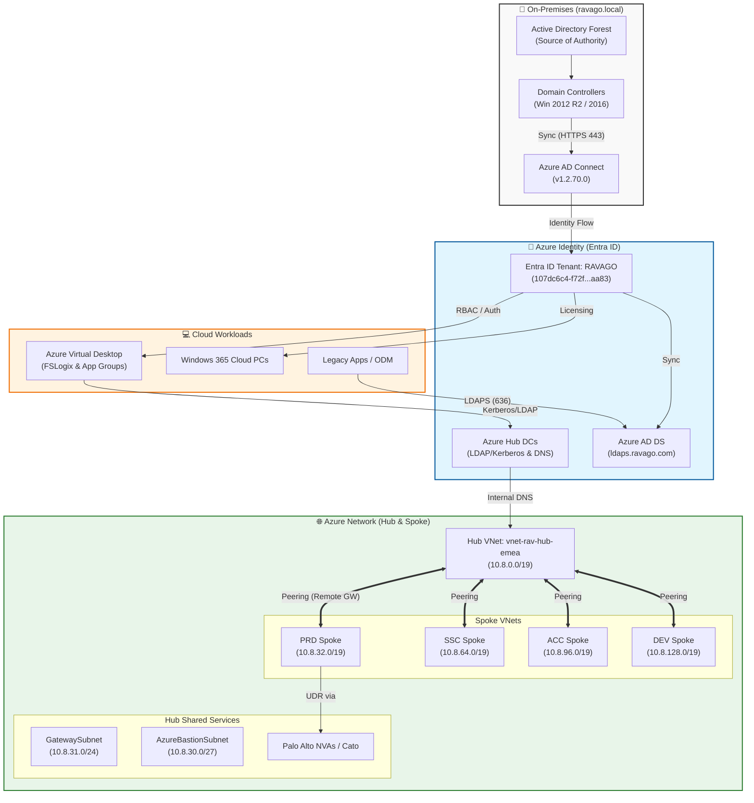

### Improvements made:
- **Logical Grouping**: Used `subgraph` to separate On-Premises, Identity, Networking, and Workloads for better readability.
- **Visual Cues**: Added icons (🏢, 🔐, 🌐, 💻) and color-coded classes to distinguish between different environment layers.
- **Accurate Flow**: Correctly mapped the identity flow from the on-prem source of authority through **Azure AD Connect** to **Entra ID**.
- **Network Specifics**: Included the specific CIDR ranges and peering logic (e.g., "Use Remote Gateway") mentioned in the [[Ravago/Ravago Infra]] note.
- **Protocol Clarity**: Added labels for key protocols like **HTTPS 443** for sync and **LDAPS 636** for application access.<svg aria-roledescription="flowchart-v2" role="graphics-document document" viewBox="0 0 3016.338623046875 1052" style="max-width: 3016.338623046875px;" class="flowchart" xmlns:xlink="http://www.w3.org/1999/xlink" xmlns="http://www.w3.org/2000/svg" width="100%" id="mermaid-diagram-mermaid-bg5v5gs"><g><marker orient="auto" markerHeight="8" markerWidth="8" markerUnits="userSpaceOnUse" refY="5" refX="5" viewBox="0 0 10 10" class="marker flowchart-v2" id="mermaid-diagram-mermaid-bg5v5gs_flowchart-v2-pointEnd"><path style="stroke-width: 1; stroke-dasharray: 1, 0;" class="arrowMarkerPath" d="M 0 0 L 10 5 L 0 10 z"></path></marker><marker orient="auto" markerHeight="8" markerWidth="8" markerUnits="userSpaceOnUse" refY="5" refX="4.5" viewBox="0 0 10 10" class="marker flowchart-v2" id="mermaid-diagram-mermaid-bg5v5gs_flowchart-v2-pointStart"><path style="stroke-width: 1; stroke-dasharray: 1, 0;" class="arrowMarkerPath" d="M 0 5 L 10 10 L 10 0 z"></path></marker><marker orient="auto" markerHeight="11" markerWidth="11" markerUnits="userSpaceOnUse" refY="5" refX="11" viewBox="0 0 10 10" class="marker flowchart-v2" id="mermaid-diagram-mermaid-bg5v5gs_flowchart-v2-circleEnd"><circle style="stroke-width: 1; stroke-dasharray: 1, 0;" class="arrowMarkerPath" r="5" cy="5" cx="5"></circle></marker><marker orient="auto" markerHeight="11" markerWidth="11" markerUnits="userSpaceOnUse" refY="5" refX="-1" viewBox="0 0 10 10" class="marker flowchart-v2" id="mermaid-diagram-mermaid-bg5v5gs_flowchart-v2-circleStart"><circle style="stroke-width: 1; stroke-dasharray: 1, 0;" class="arrowMarkerPath" r="5" cy="5" cx="5"></circle></marker><marker orient="auto" markerHeight="11" markerWidth="11" markerUnits="userSpaceOnUse" refY="5.2" refX="12" viewBox="0 0 11 11" class="marker cross flowchart-v2" id="mermaid-diagram-mermaid-bg5v5gs_flowchart-v2-crossEnd"><path style="stroke-width: 2; stroke-dasharray: 1, 0;" class="arrowMarkerPath" d="M 1,1 l 9,9 M 10,1 l -9,9"></path></marker><marker orient="auto" markerHeight="11" markerWidth="11" markerUnits="userSpaceOnUse" refY="5.2" refX="-1" viewBox="0 0 11 11" class="marker cross flowchart-v2" id="mermaid-diagram-mermaid-bg5v5gs_flowchart-v2-crossStart"><path style="stroke-width: 2; stroke-dasharray: 1, 0;" class="arrowMarkerPath" d="M 1,1 l 9,9 M 10,1 l -9,9"></path></marker><g class="root"><g class="clusters"><g data-look="classic" id="subGraph3" class="cluster"><rect height="128" width="978.1041717529297" y="255" x="8" style=""></rect><g transform="translate(397.375, 255)" class="cluster-label"><foreignObject height="24" width="199.3541717529297">

Identity &amp; Common Services

</foreignObject></g></g><g data-look="classic" id="subGraph2" class="cluster"><rect height="409" width="638.3697967529297" y="635" x="1681.9583625793457" style=""></rect><g transform="translate(1901.1432609558105, 635)" class="cluster-label"><foreignObject height="48" width="200">

North Europe - Failover (SAP Tenant)

</foreignObject></g></g><g data-look="classic" id="subGraph1" class="cluster"><rect height="434" width="668.0104169845581" y="457" x="2340.3281593322754" style=""></rect><g transform="translate(2574.3333678245544, 457)" class="cluster-label"><foreignObject height="48" width="200">

West Europe - Primary (SAP Tenant)

</foreignObject></g></g><g data-look="classic" id="subGraph0" class="cluster"><rect height="553" width="1222.4479446411133" y="8" x="1006.1041717529297" style=""></rect><g transform="translate(1518.4948081970215, 8)" class="cluster-label"><foreignObject height="24" width="197.6666717529297">

Global Infrastructure / WAN

</foreignObject></g></g></g><g class="edgePaths"><path marker-end="url(#mermaid-diagram-mermaid-bg5v5gs_flowchart-v2-pointEnd__666)" style="stroke:#666;stroke-width:1.2px;" class="edge-thickness-normal edge-pattern-solid edge-thickness-normal edge-pattern-solid flowchart-link" id="L_Internet_RavagoWAN_0" d="M1845.052,122.565L1785.016,138.471C1724.979,154.377,1604.906,186.188,1544.87,208.261C1484.833,230.333,1484.833,242.667,1484.833,252.333C1484.833,262,1484.833,269,1484.833,272.5L1484.833,276"></path><path marker-end="url(#mermaid-diagram-mermaid-bg5v5gs_flowchart-v2-pointEnd__666)" style="stroke:#666;stroke-width:1.2px;" class="edge-thickness-normal edge-pattern-solid edge-thickness-normal edge-pattern-solid flowchart-link" id="L_RavagoWAN_PrimarySite_0" d="M1354.833,342.697L1317.983,349.414C1281.132,356.131,1207.431,369.566,1170.58,382.449C1133.729,395.333,1133.729,407.667,1133.729,420C1133.729,432.333,1133.729,444.667,1151.556,455.057C1169.383,465.448,1205.037,473.896,1222.864,478.12L1240.691,482.344"></path><path marker-end="url(#mermaid-diagram-mermaid-bg5v5gs_flowchart-v2-pointEnd__666)" style="stroke:#666;stroke-width:1.2px;" class="edge-thickness-normal edge-pattern-solid edge-thickness-normal edge-pattern-solid flowchart-link" id="L_RavagoWAN_FailoverSite_0" d="M1506.758,358L1509.101,362.167C1511.443,366.333,1516.128,374.667,1518.47,385C1520.813,395.333,1520.813,407.667,1520.813,420C1520.813,432.333,1520.813,444.667,1537.961,454.897C1555.109,465.126,1589.405,473.253,1606.553,477.316L1623.702,481.379"></path><path marker-end="url(#mermaid-diagram-mermaid-bg5v5gs_flowchart-v2-pointEnd__666)" style="stroke:#666;stroke-width:1.2px;" class="edge-thickness-normal edge-pattern-solid edge-thickness-normal edge-pattern-solid flowchart-link" id="L_RavNetPaloAlto_SAP_VNet_WE_0" d="M2542.036,536L2549.356,540.167C2556.677,544.333,2571.317,552.667,2578.638,563C2585.958,573.333,2585.958,585.667,2585.958,598C2585.958,610.333,2585.958,622.667,2596.389,632.765C2606.819,642.863,2627.68,650.726,2638.111,654.658L2648.542,658.589"></path><path marker-end="url(#mermaid-diagram-mermaid-bg5v5gs_flowchart-v2-pointEnd__666)" style="stroke:#666;stroke-width:1.2px;" class="edge-thickness-normal edge-pattern-solid edge-thickness-normal edge-pattern-solid flowchart-link" id="L_SAP_VNet_WE_SAP_App_WE_0" d="M2664.314,714L2650.701,720.167C2637.088,726.333,2609.862,738.667,2596.248,752.333C2582.635,766,2582.635,781,2582.635,788.5L2582.635,796"></path><path marker-end="url(#mermaid-diagram-mermaid-bg5v5gs_flowchart-v2-pointEnd__666)" style="stroke:#666;stroke-width:1.2px;" class="edge-thickness-normal edge-pattern-solid edge-thickness-normal edge-pattern-solid flowchart-link" id="L_SAP_VNet_WE_SAP_DB_WE_0" d="M2780.463,714L2793.378,720.167C2806.293,726.333,2832.123,738.667,2845.038,752.333C2857.953,766,2857.953,781,2857.953,788.5L2857.953,796"></path><path marker-end="url(#mermaid-diagram-mermaid-bg5v5gs_flowchart-v2-pointEnd__666)" style="stroke:#666;stroke-width:1.2px;" class="edge-thickness-normal edge-pattern-solid edge-thickness-normal edge-pattern-solid flowchart-link" id="L_AVD_WE_SAP_VNet_WE_0" d="M2857.354,536L2857.354,540.167C2857.354,544.333,2857.354,552.667,2857.354,563C2857.354,573.333,2857.354,585.667,2857.354,598C2857.354,610.333,2857.354,622.667,2847.283,632.758C2837.212,642.849,2817.07,650.698,2807,654.623L2796.929,658.548"></path><path marker-end="url(#mermaid-diagram-mermaid-bg5v5gs_flowchart-v2-pointEnd__666)" style="stroke:#666;stroke-width:1.2px;" class="edge-thickness-normal edge-pattern-solid edge-thickness-normal edge-pattern-solid flowchart-link" id="L_RavNetPaloAlto_SAP_VNet_NE_0" d="M2465.555,536L2461.072,540.167C2456.59,544.333,2447.626,552.667,2443.144,563C2438.661,573.333,2438.661,585.667,2438.661,598C2438.661,610.333,2438.661,622.667,2438.661,637.5C2438.661,652.333,2438.661,669.667,2438.661,689C2438.661,708.333,2438.661,729.667,2371.845,749.828C2305.028,769.988,2171.395,788.977,2104.579,798.471L2037.762,807.965"></path><path marker-end="url(#mermaid-diagram-mermaid-bg5v5gs_flowchart-v2-pointEnd__666)" style="stroke:#666;stroke-width:1.2px;" class="edge-thickness-normal edge-pattern-solid edge-thickness-normal edge-pattern-solid flowchart-link" id="L_SAP_VNet_NE_SAP_App_NE_0" d="M1824.983,866L1816.562,870.167C1808.142,874.333,1791.3,882.667,1782.879,893C1774.458,903.333,1774.458,915.667,1780.685,927.549C1786.912,939.432,1799.367,950.863,1805.594,956.579L1811.821,962.295"></path><path marker-end="url(#mermaid-diagram-mermaid-bg5v5gs_flowchart-v2-pointEnd__666)" style="stroke:#666;stroke-width:1.2px;" class="edge-thickness-normal edge-pattern-solid edge-thickness-normal edge-pattern-solid flowchart-link" id="L_SAP_VNet_NE_SAP_DB_NE_0" d="M1992.685,866L2002.181,870.167C2011.677,874.333,2030.669,882.667,2040.165,893C2049.661,903.333,2049.661,915.667,2057.436,927.603C2065.21,939.539,2080.758,951.077,2088.532,956.847L2096.307,962.616"></path><path marker-end="url(#mermaid-diagram-mermaid-bg5v5gs_flowchart-v2-pointEnd__666)" style="stroke:#666;stroke-width:1.2px;" class="edge-thickness-normal edge-pattern-solid edge-thickness-normal edge-pattern-solid flowchart-link" id="L_AVD_NE_SAP_VNet_NE_0" d="M1903.802,714L1903.802,720.167C1903.802,726.333,1903.802,738.667,1903.802,750.333C1903.802,762,1903.802,773,1903.802,778.5L1903.802,784"></path><path marker-end="url(#mermaid-diagram-mermaid-bg5v5gs_flowchart-v2-pointEnd__666)" style="stroke:#666;stroke-width:1.2px;" class="edge-thickness-normal edge-pattern-solid edge-thickness-normal edge-pattern-solid flowchart-link" id="L_AzureAD_PrimarySite_0" d="M121.942,346L117.427,352.167C112.913,358.333,103.883,370.667,299.772,383C495.66,395.333,896.465,407.667,1096.868,420C1297.271,432.333,1297.271,444.667,1301.263,454.546C1305.255,464.425,1313.24,471.851,1317.232,475.563L1321.225,479.276"></path><path marker-end="url(#mermaid-diagram-mermaid-bg5v5gs_flowchart-v2-pointEnd__666)" style="stroke:#666;stroke-width:1.2px;" class="edge-thickness-normal edge-pattern-solid edge-thickness-normal edge-pattern-solid flowchart-link" id="L_AzureAD_FailoverSite_0" d="M240.417,335.529L287.665,343.441C334.913,351.353,429.41,367.176,670.066,381.255C910.722,395.333,1297.538,407.667,1490.946,420C1684.354,432.333,1684.354,444.667,1688.346,454.546C1692.339,464.425,1700.323,471.851,1704.316,475.563L1708.308,479.276"></path><path marker-end="url(#mermaid-diagram-mermaid-bg5v5gs_flowchart-v2-pointEnd__666)" style="stroke:#666;stroke-width:1.2px;" class="edge-thickness-normal edge-pattern-solid edge-thickness-normal edge-pattern-solid flowchart-link" id="L_AzureMonitor_PrimarySite_0" d="M306.091,346L291.554,352.167C277.018,358.333,247.944,370.667,425.123,383C602.302,395.333,985.734,407.667,1177.451,420C1369.167,432.333,1369.167,444.667,1368.082,454.363C1366.998,464.059,1364.828,471.118,1363.744,474.647L1362.659,478.176"></path><path marker-end="url(#mermaid-diagram-mermaid-bg5v5gs_flowchart-v2-pointEnd__666)" style="stroke:#666;stroke-width:1.2px;" class="edge-thickness-normal edge-pattern-solid edge-thickness-normal edge-pattern-solid flowchart-link" id="L_AzureMonitor_FailoverSite_0" d="M449.063,337.249L482.206,344.875C515.349,352.5,581.635,367.75,799.5,381.542C1017.365,395.333,1386.807,407.667,1571.529,420C1756.25,432.333,1756.25,444.667,1755.165,454.363C1754.081,464.059,1751.912,471.118,1750.827,474.647L1749.743,478.176"></path><path marker-end="url(#mermaid-diagram-mermaid-bg5v5gs_flowchart-v2-pointEnd__666)" style="stroke:#666;stroke-width:1.2px;" class="edge-thickness-normal edge-pattern-solid edge-thickness-normal edge-pattern-solid flowchart-link" id="L_MicrosoftDefender_PrimarySite_0" d="M499.063,349.754L475.641,355.295C452.219,360.836,405.375,371.918,553.726,383.626C702.076,395.333,1045.622,407.667,1217.394,420C1389.167,432.333,1389.167,444.667,1386.663,454.452C1384.159,464.237,1379.152,471.474,1376.649,475.092L1374.145,478.711"></path><path marker-end="url(#mermaid-diagram-mermaid-bg5v5gs_flowchart-v2-pointEnd__666)" style="stroke:#666;stroke-width:1.2px;" class="edge-thickness-normal edge-pattern-solid edge-thickness-normal edge-pattern-solid flowchart-link" id="L_MicrosoftDefender_FailoverSite_0" d="M725.661,358L735.982,362.167C746.302,366.333,766.943,374.667,942.041,385C1117.139,395.333,1446.694,407.667,1611.472,420C1776.25,432.333,1776.25,444.667,1773.746,454.452C1771.243,464.237,1766.236,471.474,1763.732,475.092L1761.228,478.711"></path><path marker-end="url(#mermaid-diagram-mermaid-bg5v5gs_flowchart-v2-pointEnd__666)" style="stroke:#666;stroke-width:1.2px;" class="edge-thickness-normal edge-pattern-solid edge-thickness-normal edge-pattern-solid flowchart-link" id="L_RBAC_PrimarySite_0" d="M809.063,330.774L756.559,339.479C704.056,348.183,599.049,365.591,699.066,380.462C799.083,395.333,1104.125,407.667,1256.646,420C1409.167,432.333,1409.167,444.667,1405.17,454.546C1401.173,464.426,1393.178,471.852,1389.181,475.565L1385.184,479.278"></path><path marker-end="url(#mermaid-diagram-mermaid-bg5v5gs_flowchart-v2-pointEnd__666)" style="stroke:#666;stroke-width:1.2px;" class="edge-thickness-normal edge-pattern-solid edge-thickness-normal edge-pattern-solid flowchart-link" id="L_RBAC_FailoverSite_0" d="M898.228,346L902.373,352.167C906.517,358.333,914.805,370.667,1064.476,383C1214.146,395.333,1505.198,407.667,1650.724,420C1796.25,432.333,1796.25,444.667,1792.253,454.546C1788.256,464.426,1780.262,471.852,1776.265,475.565L1772.268,479.278"></path><path marker-end="url(#mermaid-diagram-mermaid-bg5v5gs_flowchart-v2-pointEnd__666)" marker-start="url(#mermaid-diagram-mermaid-bg5v5gs_flowchart-v2-pointStart__666)" style="stroke:#666;stroke-width:1.2px;" class="edge-thickness-normal edge-pattern-solid edge-thickness-normal edge-pattern-solid flowchart-link" id="L_SAP_App_WE_SAP_App_NE_0" d="M2582.635,858L2582.635,863.5C2582.635,869,2582.635,880,2477.382,891.667C2372.129,903.333,2161.622,915.667,2046.637,927.658C1931.652,939.649,1912.189,951.297,1902.458,957.121L1892.727,962.946"></path><path marker-end="url(#mermaid-diagram-mermaid-bg5v5gs_flowchart-v2-pointEnd__666)" marker-start="url(#mermaid-diagram-mermaid-bg5v5gs_flowchart-v2-pointStart__666)" style="stroke:#666;stroke-width:1.2px;" class="edge-thickness-normal edge-pattern-solid edge-thickness-normal edge-pattern-solid flowchart-link" id="L_SAP_DB_WE_SAP_DB_NE_0" d="M2857.953,858L2857.953,863.5C2857.953,869,2857.953,880,2746.635,891.667C2635.318,903.333,2412.682,915.667,2296.578,927.491C2180.474,939.315,2170.901,950.631,2166.114,956.289L2161.327,961.946"></path><path marker-end="url(#mermaid-diagram-mermaid-bg5v5gs_flowchart-v2-pointEnd__666)" style="stroke:#666;stroke-width:1.2px;" class="edge-thickness-normal edge-pattern-solid edge-thickness-normal edge-pattern-solid flowchart-link" id="L_Internet_AVD_WE_0" d="M1956.664,134L1984.075,148C2011.485,162,2066.305,190,2093.715,210.167C2121.125,230.333,2121.125,242.667,2121.125,259.5C2121.125,276.333,2121.125,297.667,2121.125,319C2121.125,340.333,2121.125,361.667,2121.125,378.5C2121.125,395.333,2121.125,407.667,2121.125,420C2121.125,432.333,2121.125,444.667,2225.391,458.198C2329.656,471.729,2538.187,486.457,2642.453,493.821L2746.718,501.186"></path><path marker-end="url(#mermaid-diagram-mermaid-bg5v5gs_flowchart-v2-pointEnd__666)" style="stroke:#666;stroke-width:1.2px;" class="edge-thickness-normal edge-pattern-solid edge-thickness-normal edge-pattern-solid flowchart-link" id="L_Internet_AVD_NE_0" d="M1903.802,134L1903.802,148C1903.802,162,1903.802,190,1903.802,210.167C1903.802,230.333,1903.802,242.667,1903.802,259.5C1903.802,276.333,1903.802,297.667,1903.802,319C1903.802,340.333,1903.802,361.667,1903.802,378.5C1903.802,395.333,1903.802,407.667,1903.802,420C1903.802,432.333,1903.802,444.667,1903.802,459.5C1903.802,474.333,1903.802,491.667,1903.802,509C1903.802,526.333,1903.802,543.667,1903.802,558.5C1903.802,573.333,1903.802,585.667,1903.802,598C1903.802,610.333,1903.802,622.667,1903.802,632.333C1903.802,642,1903.802,649,1903.802,652.5L1903.802,656"></path><path marker-end="url(#mermaid-diagram-mermaid-bg5v5gs_flowchart-v2-pointEnd__666)" marker-start="url(#mermaid-diagram-mermaid-bg5v5gs_flowchart-v2-pointStart__666)" style="stroke:#666;stroke-width:1.2px;" class="edge-thickness-normal edge-pattern-solid edge-thickness-normal edge-pattern-solid flowchart-link" id="L_RavagoWAN_RavNetPaloAlto_0" d="M1618.808,334.007L1691.703,342.173C1764.598,350.338,1910.388,366.669,1983.282,381.001C2056.177,395.333,2056.177,407.667,2056.177,420C2056.177,432.333,2056.177,444.667,2108.707,457.064C2161.237,469.461,2266.296,481.922,2318.826,488.152L2371.356,494.382"></path></g><g class="edgeLabels"><g transform="translate(1484.833351135254, 218)" class="edgeLabel"><g transform="translate(-58.125, -12)" class="label"><foreignObject height="24" width="116.25">

SD-WAN Firewall

</foreignObject></g></g><g transform="translate(1133.7291717529297, 420)" class="edgeLabel"><g transform="translate(-91.64583587646484, -12)" class="label"><foreignObject height="24" width="183.2916717529297">

MPLS / Internet / SD-WAN

</foreignObject></g></g><g transform="translate(1520.812515258789, 420)" class="edgeLabel"><g transform="translate(-91.64583587646484, -12)" class="label"><foreignObject height="24" width="183.2916717529297">

MPLS / Internet / SD-WAN

</foreignObject></g></g><g transform="translate(2585.958369255066, 598)" class="edgeLabel"><g transform="translate(-22.39583396911621, -12)" class="label"><foreignObject height="24" width="44.79166793823242">

Uplink

</foreignObject></g></g><g class="edgeLabel"><g transform="translate(0, 0)" class="label"><foreignObject height="0" width="0">

</foreignObject></g></g><g class="edgeLabel"><g transform="translate(0, 0)" class="label"><foreignObject height="0" width="0">

</foreignObject></g></g><g transform="translate(2857.3542013168335, 598)" class="edgeLabel"><g transform="translate(-22.666667938232422, -12)" class="label"><foreignObject height="24" width="45.333335876464844">

access

</foreignObject></g></g><g transform="translate(2438.661494255066, 687)" class="edgeLabel"><g transform="translate(-22.39583396911621, -12)" class="label"><foreignObject height="24" width="44.79166793823242">

Uplink

</foreignObject></g></g><g class="edgeLabel"><g transform="translate(0, 0)" class="label"><foreignObject height="0" width="0">

</foreignObject></g></g><g class="edgeLabel"><g transform="translate(0, 0)" class="label"><foreignObject height="0" width="0">

</foreignObject></g></g><g transform="translate(1903.8021087646484, 751)" class="edgeLabel"><g transform="translate(-22.666667938232422, -12)" class="label"><foreignObject height="24" width="45.333335876464844">

access

</foreignObject></g></g><g transform="translate(1297.2708435058594, 420)" class="edgeLabel"><g transform="translate(-51.895835876464844, -12)" class="label"><foreignObject height="24" width="103.79167175292969">

authentication

</foreignObject></g></g><g transform="translate(1684.3541870117188, 420)" class="edgeLabel"><g transform="translate(-51.895835876464844, -12)" class="label"><foreignObject height="24" width="103.79167175292969">

authentication

</foreignObject></g></g><g class="edgeLabel"><g transform="translate(0, 0)" class="label"><foreignObject height="0" width="0">

</foreignObject></g></g><g class="edgeLabel"><g transform="translate(0, 0)" class="label"><foreignObject height="0" width="0">

</foreignObject></g></g><g class="edgeLabel"><g transform="translate(0, 0)" class="label"><foreignObject height="0" width="0">

</foreignObject></g></g><g class="edgeLabel"><g transform="translate(0, 0)" class="label"><foreignObject height="0" width="0">

</foreignObject></g></g><g class="edgeLabel"><g transform="translate(0, 0)" class="label"><foreignObject height="0" width="0">

</foreignObject></g></g><g class="edgeLabel"><g transform="translate(0, 0)" class="label"><foreignObject height="0" width="0">

</foreignObject></g></g><g transform="translate(1951.114610671997, 928)" class="edgeLabel"><g transform="translate(-57.85416793823242, -12)" class="label"><foreignObject height="24" width="115.70833587646484">

Replication / DR

</foreignObject></g></g><g transform="translate(2190.046905517578, 928)" class="edgeLabel"><g transform="translate(-88.29167175292969, -12)" class="label"><foreignObject height="24" width="176.58334350585938">

HANA System Replication

</foreignObject></g></g><g transform="translate(2121.125030517578, 319)" class="edgeLabel"><g transform="translate(-87.42708587646484, -12)" class="label"><foreignObject height="24" width="174.8541717529297">

User / Consultant access

</foreignObject></g></g><g transform="translate(1903.8021087646484, 420)" class="edgeLabel"><g transform="translate(-87.42708587646484, -12)" class="label"><foreignObject height="24" width="174.8541717529297">

User / Consultant access

</foreignObject></g></g><g transform="translate(2056.1771125793457, 420)" class="edgeLabel"><g transform="translate(-44.94791793823242, -12)" class="label"><foreignObject height="24" width="89.89583587646484">

bidirectional

</foreignObject></g></g></g><g class="nodes"><g transform="translate(40.68748474121094, 25)" class="root"><g class="clusters"><g data-look="classic" id="subGraph4" class="cluster"><rect height="148" width="922.4166717529297" y="8" x="8" style=""></rect><g transform="translate(385.55208587646484, 8)" class="cluster-label"><foreignObject height="24" width="167.3125">

OT / Plant Connectivity

</foreignObject></g></g></g><g class="edgePaths"><path marker-end="url(#mermaid-diagram-mermaid-bg5v5gs_flowchart-v2-pointEnd__666)" style="stroke:#666;stroke-width:1.2px;" class="edge-thickness-normal edge-pattern-solid edge-thickness-normal edge-pattern-solid flowchart-link" id="L_RavagoOT_OT_Firewall_0" d="M300.521,82L316.519,82C332.517,82,364.514,82,395.844,82C427.174,82,457.837,82,473.168,82L488.5,82"></path><path marker-end="url(#mermaid-diagram-mermaid-bg5v5gs_flowchart-v2-pointEnd__666)" style="stroke:#666;stroke-width:1.2px;" class="edge-thickness-normal edge-pattern-solid edge-thickness-normal edge-pattern-solid flowchart-link" id="L_OT_Firewall_PLC_Unmanaged_0" d="M633.667,82L639.917,82C646.167,82,658.667,82,670.5,82C682.333,82,693.5,82,699.083,82L704.667,82"></path></g><g class="edgeLabels"><g transform="translate(396.51041412353516, 82)" class="edgeLabel"><g transform="translate(-58.489585876464844, -12)" class="label"><foreignObject height="24" width="116.97917175292969">

RavNet Palo Alto

</foreignObject></g></g><g class="edgeLabel"><g transform="translate(0, 0)" class="label"><foreignObject height="0" width="0">

</foreignObject></g></g></g><g class="nodes"><g transform="translate(173.01041412353516, 82)" id="flowchart-RavagoOT-38" class="node default ot"><rect height="78" width="255.02084350585938" y="-39" x="-127.51042175292969" style="fill:#d83b01 !important;stroke:#a62f01 !important" class="basic label-container"></rect><g transform="translate(-97.51042175292969, -24)" style="color:white !important" class="label"><rect></rect><foreignObject height="48" width="195.02084350585938">

Ravago OT-Partner Network 192.168.0.0/16

</foreignObject></g></g><g transform="translate(563.0833358764648, 82)" id="flowchart-OT_Firewall-39" class="node default ot"><rect height="54" width="141.1666717529297" y="-27" x="-70.58333587646484" style="fill:#d83b01 !important;stroke:#a62f01 !important" class="basic label-container"></rect><g transform="translate(-40.583335876464844, -12)" style="color:white !important" class="label"><rect></rect><foreignObject height="24" width="81.16667175292969">

OT Firewall

</foreignObject></g></g><g transform="translate(800.7916717529297, 82)" id="flowchart-PLC_Unmanaged-41" class="node default ot"><rect height="78" width="184.25" y="-39" x="-92.125" style="fill:#d83b01 !important;stroke:#a62f01 !important" class="basic label-container"></rect><g transform="translate(-62.125, -24)" style="color:white !important" class="label"><rect></rect><foreignObject height="48" width="124.25">

PLC – Unmanaged 10.23.0.0/24

</foreignObject></g></g></g></g><g transform="translate(1903.8021087646484, 107)" id="flowchart-Internet-0" class="node default network"><rect height="54" width="117.5" y="-27" x="-58.75" style="fill:#107c10 !important;stroke:#0b5a0b !important;stroke-width:1px !important" class="basic label-container"></rect><g transform="translate(-28.75, -12)" style="color:white !important" class="label"><rect></rect><foreignObject height="24" width="57.5">

Internet

</foreignObject></g></g><g transform="translate(1484.833351135254, 319)" id="flowchart-RavagoWAN-1" class="node default network"><rect height="78" width="260" y="-39" x="-130" style="fill:#107c10 !important;stroke:#0b5a0b !important;stroke-width:1px !important" class="basic label-container"></rect><g transform="translate(-100, -24)" style="color:white !important" class="label"><rect></rect><foreignObject height="48" width="200">

Ravago WAN / SD-WAN Appliance

</foreignObject></g></g><g transform="translate(1353.187515258789, 509)" id="flowchart-PrimarySite-3" class="node default"><rect height="54" width="217.20834350585938" y="-27" x="-108.60417175292969" style="" class="basic label-container"></rect><g transform="translate(-78.60417175292969, -12)" style="" class="label"><rect></rect><foreignObject height="24" width="157.20834350585938">

West Europe - Primary

</foreignObject></g></g><g transform="translate(1740.2708587646484, 509)" id="flowchart-FailoverSite-5" class="node default"><rect height="54" width="225.3541717529297" y="-27" x="-112.67708587646484" style="" class="basic label-container"></rect><g transform="translate(-82.67708587646484, -12)" style="" class="label"><rect></rect><foreignObject height="24" width="165.3541717529297">

North Europe - Failover

</foreignObject></g></g><g transform="translate(2494.5989952087402, 509)" id="flowchart-RavNetPaloAlto-6" class="node default network"><rect height="54" width="238.5416717529297" y="-27" x="-119.27083587646484" style="fill:#107c10 !important;stroke:#0b5a0b !important;stroke-width:1px !important" class="basic label-container"></rect><g transform="translate(-89.27083587646484, -12)" style="color:white !important" class="label"><rect></rect><foreignObject height="24" width="178.5416717529297">

RavNet Palo Alto Firewall

</foreignObject></g></g><g transform="translate(2723.9167051315308, 687)" id="flowchart-SAP_VNet_WE-7" class="node default sap"><rect height="54" width="250.64584350585938" y="-27" x="-125.32292175292969" style="fill:#0078d4 !important;stroke:#005a9e !important" class="basic label-container"></rect><g transform="translate(-95.32292175292969, -12)" style="color:white !important" class="label"><rect></rect><foreignObject height="24" width="190.64584350585938">

Azure VNet - rav-prd-emea

</foreignObject></g></g><g transform="translate(2582.6354513168335, 827)" id="flowchart-SAP_App_WE-9" class="node default sap"><rect height="54" width="225.25" y="-27" x="-112.625" style="fill:#0078d4 !important;stroke:#005a9e !important" class="basic label-container"></rect><g transform="translate(-82.625, -12)" style="color:white !important" class="label"><rect></rect><foreignObject height="24" width="165.25">

SAP Application Servers

</foreignObject></g></g><g transform="translate(2857.9531621932983, 827)" id="flowchart-SAP_DB_WE-11" class="node default sap"><rect height="54" width="210.89584350585938" y="-27" x="-105.44792175292969" style="fill:#0078d4 !important;stroke:#005a9e !important" class="basic label-container"></rect><g transform="translate(-75.44792175292969, -12)" style="color:white !important" class="label"><rect></rect><foreignObject height="24" width="150.89584350585938">

SAP HANA / Database

</foreignObject></g></g><g transform="translate(2857.3542013168335, 509)" id="flowchart-AVD_WE-12" class="node default azure"><rect height="54" width="213.2916717529297" y="-27" x="-106.64583587646484" style="fill:#0078d4 !important;stroke:#005a9e !important;stroke-width:1px !important" class="basic label-container"></rect><g transform="translate(-76.64583587646484, -12)" style="color:white !important" class="label"><rect></rect><foreignObject height="24" width="153.2916717529297">

Azure Virtual Desktop

</foreignObject></g></g><g transform="translate(1903.8021087646484, 827)" id="flowchart-SAP_VNet_NE-15" class="node default sap"><rect height="78" width="260" y="-39" x="-130" style="fill:#0078d4 !important;stroke:#005a9e !important" class="basic label-container"></rect><g transform="translate(-100, -24)" style="color:white !important" class="label"><rect></rect><foreignObject height="48" width="200">

Azure VNet - rav-prd-ne failover

</foreignObject></g></g><g transform="translate(1844.1823196411133, 992)" id="flowchart-SAP_App_NE-17" class="node default sap"><rect height="54" width="248.89584350585938" y="-27" x="-124.44792175292969" style="fill:#0078d4 !important;stroke:#005a9e !important" class="basic label-container"></rect><g transform="translate(-94.44792175292969, -12)" style="color:white !important" class="label"><rect></rect><foreignObject height="24" width="188.89584350585938">

SAP Application Servers DR

</foreignObject></g></g><g transform="translate(2135.9010696411133, 992)" id="flowchart-SAP_DB_NE-19" class="node default sap"><rect height="54" width="234.5416717529297" y="-27" x="-117.27083587646484" style="fill:#0078d4 !important;stroke:#005a9e !important" class="basic label-container"></rect><g transform="translate(-87.27083587646484, -12)" style="color:white !important" class="label"><rect></rect><foreignObject height="24" width="174.5416717529297">

SAP HANA / Database DR

</foreignObject></g></g><g transform="translate(1903.8021087646484, 687)" id="flowchart-AVD_NE-20" class="node default azure"><rect height="54" width="213.2916717529297" y="-27" x="-106.64583587646484" style="fill:#0078d4 !important;stroke:#005a9e !important;stroke-width:1px !important" class="basic label-container"></rect><g transform="translate(-76.64583587646484, -12)" style="color:white !important" class="label"><rect></rect><foreignObject height="24" width="153.2916717529297">

Azure Virtual Desktop

</foreignObject></g></g><g transform="translate(141.70833587646484, 319)" id="flowchart-AzureAD-22" class="node default security"><rect height="54" width="197.4166717529297" y="-27" x="-98.70833587646484" style="fill:#a80000 !important;stroke:#750000 !important;stroke-width:1px !important" class="basic label-container"></rect><g transform="translate(-68.70833587646484, -12)" style="color:white !important" class="label"><rect></rect><foreignObject height="24" width="137.4166717529297">

Azure AD / Entra ID

</foreignObject></g></g><g transform="translate(369.73958587646484, 319)" id="flowchart-AzureMonitor-26" class="node default security"><rect height="54" width="158.64583587646484" y="-27" x="-79.32291793823242" style="fill:#a80000 !important;stroke:#750000 !important;stroke-width:1px !important" class="basic label-container"></rect><g transform="translate(-49.32291793823242, -12)" style="color:white !important" class="label"><rect></rect><foreignObject height="24" width="98.64583587646484">

Azure Monitor

</foreignObject></g></g><g transform="translate(629.0625, 319)" id="flowchart-MicrosoftDefender-30" class="node default security"><rect height="78" width="260" y="-39" x="-130" style="fill:#a80000 !important;stroke:#750000 !important;stroke-width:1px !important" class="basic label-container"></rect><g transform="translate(-100, -24)" style="color:white !important" class="label"><rect></rect><foreignObject height="48" width="200">

Microsoft Defender for Cloud

</foreignObject></g></g><g transform="translate(880.0833358764648, 319)" id="flowchart-RBAC-34" class="node default security"><rect height="54" width="142.0416717529297" y="-27" x="-71.02083587646484" style="fill:#a80000 !important;stroke:#750000 !important;stroke-width:1px !important" class="basic label-container"></rect><g transform="translate(-41.020835876464844, -12)" style="color:white !important" class="label"><rect></rect><foreignObject height="24" width="82.04167175292969">

RBAC &amp; PIM

</foreignObject></g></g></g></g><marker orient="auto" markerHeight="8" markerWidth="8" markerUnits="userSpaceOnUse" refY="5" refX="5" viewBox="0 0 10 10" class="marker flowchart-v2" id="mermaid-diagram-mermaid-bg5v5gs_flowchart-v2-pointEnd__666"><path fill="#666" stroke="#666" style="stroke-width: 1; stroke-dasharray: 1, 0;" class="arrowMarkerPath" d="M 0 0 L 10 5 L 0 10 z"></path></marker><marker orient="auto" markerHeight="8" markerWidth="8" markerUnits="userSpaceOnUse" refY="5" refX="4.5" viewBox="0 0 10 10" class="marker flowchart-v2" id="mermaid-diagram-mermaid-bg5v5gs_flowchart-v2-pointStart__666"><path fill="#666" stroke="#666" style="stroke-width: 1; stroke-dasharray: 1, 0;" class="arrowMarkerPath" d="M 0 5 L 10 10 L 10 0 z"></path></marker></g></svg>